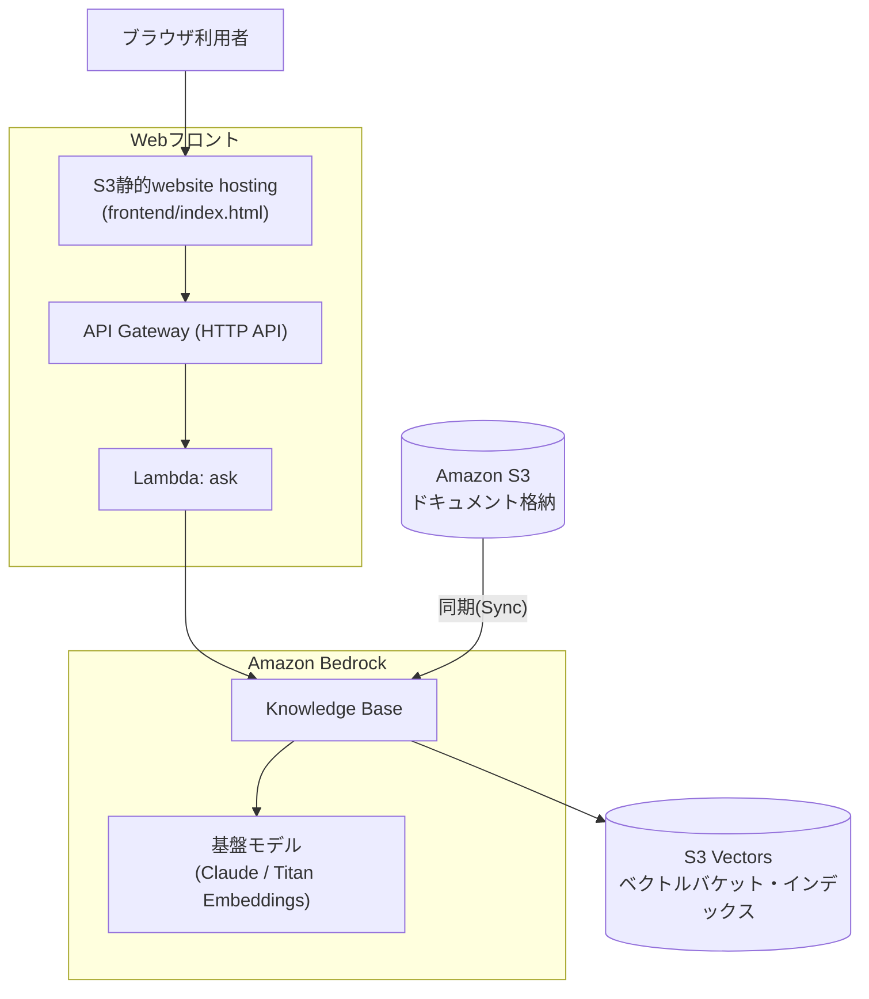

# ① 社内ナレッジAIチャットボット

社内資料をS3に集約し、低コストなAmazon S3 Vectorsをベクトルストアに用いたAmazon Bedrock Knowledge Basesでベクトル検索可能なAIチャットボットを構築する。ワークショップで出たアイデアを集約・選定した結果として、この構成を採用する。**45〜60分**で構築できる最小構成を想定している。

旅行予約・保険といった特定業務ではなく、**社内業務処理（経費精算・在宅勤務規定など）に関する問い合わせに答える汎用の社内ナレッジチャットボット**が題材（`sample-docs/`参照）。

この構成は[quest-aws-chatbot](../quest-aws-chatbot)（Aurora・複数パターン・Amplifyフロントエンドまで作り込んだ発展版）の**Basic共通版**にあたる。まずはこちらで最小構成を体験し、時間が余ったチームは発展版の追加ワーク（パターン①②）に進む想定。

**使用サービス**: Amazon S3 / Amazon S3 Vectors / Amazon Bedrock Knowledge Bases / Titan Embeddings / Claude（Bedrock）/ IAM

**主要手順（概要）**
1. S3バケットを作成し、社内資料（PDF・Word・テキスト）をアップロードする
2. Bedrockコンソールで「ナレッジベース」を新規作成し、データソースにS3バケットを指定する
3. 埋め込みモデル（Titan Embeddings）とベクトルストア（Amazon S3 Vectors）を選択し、同期を実行する
4. Webフロントエンド（下記「Webフロントで動作確認する」参照）から質問を入力し、回答を確認する

画面遷移レベルの詳細手順は下記「手順（コンソール操作）」を参照。

### 推奨アーキテクチャ（S3 Vectors版）



### 使用するAWSサービス／リソース一覧

| サービス | 役割 | 備考 |
|---|---|---|
| Amazon S3 | 元データ（ドキュメント）の格納 | 公開設定禁止 |
| Amazon S3 Vectors | ベクトルストア（埋め込みベクトルの保存先） | 保存量・クエリ課金で低コスト。OpenSearch Serverlessのような常時起動コストが発生しない |
| Amazon Bedrock Knowledge Base | RAGの中核。Embedding・検索・回答生成を統合 | 最小工数で構築可 |
| 基盤モデル（Claude等） | 回答生成・埋め込み生成 | 事前にモデルアクセスの有効化が必要 |
| IAM ロール | Knowledge BaseがS3・S3 Vectors・基盤モデルを操作するための権限 | 最小権限で付与 |

## 禁止事項（社内ルール／セキュリティ観点）

- ❌ S3バケット・S3 Vectorsバケットの公開設定（パブリックアクセス）
- ❌ 機密度の高い実データ・個人情報のアップロード（デモ用データのみ使用）
- ❌ IAMの過剰権限（`AdministratorAccess`等）の安易な付与
- ❌ サンドボックス環境外のリソースへのアクセス
- ❌ APIキー・認証情報のハードコーディング／外部共有
- ❌ ドキュメント用バケットとベクトルバケットの取り違え（役割を明確に分ける）

## 手順（マネジメントコンソール操作）

※ コンソールの画面・メニュー名はAWSのアップデートにより変わることがある。表示が異なる場合は名称の近いメニューを探すこと。

### 1. S3バケットを作成し、ドキュメントをアップロードする

1. マネジメントコンソールで **S3** を開く
2. 左メニュー「General purpose buckets」→ **「バケットを作成」**
3. バケット名を入力（例: `<チーム名>-documents`、全世界で一意な名前が必要）。リージョンはハンズオン共通のリージョン（例: 東京 ap-northeast-1）を選択
4. 「このバケットのブロックパブリックアクセス設定」は**デフォルトのまま（すべてブロック）**にする
5. 「バケットを作成」をクリック
6. 作成したバケットを開き、**「アップロード」→「ファイルを追加」**で社内ドキュメント（Markdown/PDF/Word等）を選択し、**「アップロード」**を実行する。サンプルとして本リポジトリの`sample-docs/`（経費精算規定・在宅勤務規定）を使ってもよい

### 2. S3 Vectorsのベクトルバケット・インデックスを作成する

1. S3コンソールの左メニュー「Vector buckets」を開く（「General purpose buckets」と並んで表示される）
2. **「ベクトルバケットを作成」**をクリックし、バケット名を入力（例: `<チーム名>-vectors`）。暗号化はデフォルト（SSE-S3）のままでよい → 作成
3. 作成したベクトルバケットを開き、**「インデックス」タブ →「ベクトルインデックスを作成」**
4. 以下を入力する
   - **インデックス名**: 任意（例: `kb-index`）
   - **次元数（dimension）**: 使用する埋め込みモデルに合わせる。Titan Text Embeddings V2なら`1024`（下記「補足」参照）
   - **距離指標（distance metric）**: コサイン類似度（cosine）でよい
   - **メタデータ設定（non-filterable metadata keys）**: `AMAZON_BEDROCK_TEXT` と `AMAZON_BEDROCK_METADATA` の**2つを両方**追加する（★重要。詳細は下記「つまづきポイント」参照。ここを省略すると同期がほぼ全件失敗する）
5. 「ベクトルインデックスを作成」をクリック

### 3. Bedrockのモデルアクセスを有効化する

1. マネジメントコンソールで **Amazon Bedrock** を開く
2. 左メニュー下部の**「モデルアクセス」**をクリック
3. **「モデルアクセスを管理」**（または「特定のモデルを有効にする」）をクリック
4. 埋め込みモデル（**Titan Text Embeddings V2**）と回答生成モデル（**Claude**、選択可能なバージョンでよい）にチェックを入れる
5. 「次へ」→ 利用規約を確認し**「送信」**。ステータスが「アクセス許可済み」になるまで数分待つ

### 4. Bedrock Knowledge Baseを作成する

1. Bedrockコンソール左メニューの**「Knowledge Bases」**（Builder toolsの中）を開き、**「作成」→「ナレッジベースを作成」**
2. ナレッジベース名を入力
3. **IAM権限**: 「新しいサービスロールを作成して使用する」（推奨、必要な権限が自動付与される）を選択
4. データソースのタイプで**「S3」**を選択 → 次へ
5. データソース名を入力し、**S3 URI**で手順1で作成したバケットを指定（「参照」から選択可能）
6. チャンク戦略・パース戦略はデフォルトのままでよい → 次へ
7. **埋め込みモデル**: 「Titan Text Embeddings V2」を選択し、埋め込みの次元数を手順2のベクトルインデックスと**同じ値（例: 1024）**に設定する
8. **ベクトルストア**: 「既存のベクトルストアを使用する」→ ストアの種類で**「Amazon S3 Vectors」**を選択し、手順2で作成したベクトルバケット・ベクトルインデックスを指定する
9. 「次へ」で設定内容を確認し、**「ナレッジベースを作成」**をクリック（作成に数十秒〜1分程度かかる）

### 5. データソースを同期（Sync）する

1. 作成したKnowledge Baseの詳細画面を開く
2. 「データソース」欄で対象のデータソースにチェックを入れ、**「同期」**ボタンをクリック
3. ステータスが「同期中」→「使用可能」（Available/Ready）になるまで待つ（ドキュメント数が少なければ数十秒程度）

### 6. 動作確認する

Bedrockコンソールのテスト画面は使わず、Webフロントエンド（下記「Webフロントで動作確認する」参照、`terraform apply`で自動デプロイされる）またはcurlでのAPI直接呼び出しで動作確認する。

1. Webフロントエンド（`frontend_url`出力のURL）を開くか、`curl -X POST https://<api_endpoint>/ask -d '{"question": "在宅勤務は週に何日まで使えますか？"}'`を実行する
2. アップロードしたドキュメントの内容に基づいて回答が返ること、回答と一緒に**出典（ソースのURI）**も返ることを確認する

## 問い合わせ例

後述のWebフロント・curlから試せる質問例。現在取り込んでいる文書（`sample-docs/`）の内容に基づく。

**社内業務（経費精算・在宅勤務）**
- 経費精算はどのように申請すればいいですか？
- 経費精算の申請期限はいつまでですか？
- 取引先との会食費はいくらまで精算できますか？
- 領収書がない経費は精算できますか？
- 在宅勤務は週に何日まで使えますか？
- 在宅勤務の事前申請はいつまでに必要ですか？
- 海外からの在宅勤務は可能ですか？
- 在宅勤務手当はいくらですか？

**旅行業法・規定（観光庁公開資料、`sample-docs/gov/`）**
- 標準旅行業約款とは何ですか？
- 募集型企画旅行契約と受注型企画旅行契約の違いは何ですか？
- 旅行業法施行規則で観光庁長官が定める区域とはどのような場所ですか？
- オンライン旅行取引の表示等に関するガイドライン（OTAガイドライン）ではどのような表示が求められていますか？
- インターネット取引を利用する旅行業務について、どのような取扱いが定められていますか？
- 旅行業法第2条に規定する「旅行業」とはどのような業務を指しますか？
- 自治体が関与するツアーの実施は旅行業法上どのように扱われますか？
- 旅行業務及び旅行サービス手配業務におけるテレワークの実施基準を教えてください
- 第三種旅行業務及び地域限定の範囲はどのように定められていますか？
- 旅行業法における申請に対する処分の審査基準・標準処理期間はどうなっていますか？

**旅行業務取扱管理者試験（過去問、`sample-docs/gov/exam/`）**
- 地域限定旅行業務取扱管理者試験にはどのような科目がありますか？
- 令和4年度の試験問題にはどのような内容が含まれていますか？
- 旅程管理研修の内容及び方法の基準はどうなっていますか？
- 旅行サービス手配業務取扱管理者研修の内容を教えてください
- 地域限定旅行業務取扱管理者試験の合格基準は何点ですか？
- 令和2年度と令和3年度の試験内容にはどのような違いがありますか？

**会話継続（マルチターン、下記「会話履歴の保持」参照）**
```
1. 経費精算の申請期限はいつまでですか？
2. （続けて）それは何日以内ですか？
```

## つまづきポイントとヒント

| つまづきポイント | ヒント |
|---|---|
| データをどこに置く？ | まずS3バケットを作成しドキュメントをアップロードする |
| ベクトルの保存先は？ | S3ベクトルバケット（Vector bucket）を作成する |
| ベクトルインデックスは？ | ベクトルバケット内にベクトルインデックスを作成する（次元数は選択する埋め込みモデルに合わせる） |
| 検索させたい | Bedrock Knowledge Baseを作成し、データソースにS3を指定する |
| データソース設定 | データソースにドキュメント用S3バケットを指定する |
| データを反映したい | 作成後「同期（Sync）」を実行してベクトル化・格納する |
| モデルが使えない | 事前にBedrockのモデルアクセス（埋め込み／生成モデル）を有効化する |
| 動作確認したい | Knowledge Baseの「テスト」画面でチャット確認する |
| 権限エラーが出る | IAMロールにS3読み取り＋S3 Vectors操作＋Bedrock実行権限を付与する |
| **同期がほぼ全件失敗する（★重要）** | ベクトルインデックスの`non-filterable metadata keys`に`AMAZON_BEDROCK_TEXT`と`AMAZON_BEDROCK_METADATA`の両方を含めているか確認する。片方だけだと「フィルタ可能メタデータは1ベクトルあたり2048バイトまで」という制限にすぐ達し、ほとんどのチャンクが取り込み失敗する（実機検証で確認済みの実例） |

### 補足: 埋め込みモデルと次元数の対応

ベクトルインデックス作成時に**次元数（dimension）**の指定が必要。ここがKnowledge Base側で選んだ埋め込みモデルの次元数と不一致だと同期に失敗するため、重点的に確認すること。

| 埋め込みモデル例 | 次元数 |
|---|---|
| Amazon Titan Text Embeddings V2 | 1024 / 512 / 256（選択可） |
| Cohere Embed | 1024 |

## 追加ワークの技術補足（時間が余ったチーム向け）

- **パターン①: ナレッジベースの分岐** — Bedrockで複数のKnowledge Baseを用途別（仕様書系／チケット系等）に作成するか、1つのKB内でメタデータフィルタリングにより分岐させる
- **パターン②: データ種別で処理を分岐** — Excel等の構造化データはAmazon Athena／RDS等でSQLクエリ、パワポ・画像等の非構造化データはKnowledge Base（RAG）で検索する。ルーティング判定にはLambdaまたはBedrock Agentを利用する

より作り込んだ実装例（Terraformでの完全自動化・Aurora+Bedrock Agentによる自律ルーティング等）は[quest-aws-chatbot](../quest-aws-chatbot)を参照。

## ディスカッション想定キーワード（運営向け）

「なぜこのままでは本番運用に乗せられないか」を議論する際の想定キーワード。

| 論点 | 想定キーワード |
|---|---|
| データ更新の問題 | 実データはBox等の社内システムに格納されており、手動アップロードが必要 |
| 鮮度の問題 | 新情報の自動連携ができていない |
| コスト | 本構成はS3 Vectorsのため低コストだが、OpenSearch Serverless等を選ぶ場合は常時稼働コストが論点になる |
| セキュリティ／権限 | 誰がアクセスできるかの制御 |
| 解決の方向性 | 自動連携（Box→S3等）の実現には、Box管理者との連携調整が別途発生する |

## Webフロントで動作確認する

Bedrockコンソールのテスト画面は使わず、ブラウザから質問できる**Amplifyではなく、S3の静的website hosting**で配信する軽量なフロントで動作確認する（`terraform/`で自動デプロイされる、構成図は上記「推奨アーキテクチャ」を参照）。ビルドパイプラインを持たないHTML1枚構成のため、Amplifyより単純・低コスト。

- `frontend/index.html` — プレーンHTML+JS（ビルド不要）のチャット画面
- `lambda_function.py` + API Gateway（`POST /ask`）— Knowledge BaseにRetrieveAndGenerateするだけの薄いLambda
- フロント用S3バケットのみ公開設定（ドキュメント用バケットは非公開のまま）

**`lambda_function.py`の処理内容**

| 要素 | 役割 |
|---|---|
| `PROMPT_TEMPLATE` | `RetrieveAndGenerate`のデフォルト生成プロンプトを差し替えるカスタムテンプレート。手続き系の質問にMermaidフローチャートを追加する指示を含む（詳細は下記「Mermaidフローチャート自動生成」参照）。`$search_results$`（検索結果）・`$output_format_instructions$`（出典表示に必須）の2つのプレースホルダーは必ず残す |
| `_retrieve_and_generate(question, session_id)` | Bedrock KBの`retrieve_and_generate`を呼び出す本体。`session_id`が渡されていれば`sessionId`として引き継ぎ、会話の文脈を継続する |
| `ask_knowledge_base(question, session_id)` | `_retrieve_and_generate`を呼び、`ClientError`が発生し、かつメッセージに"session"が含まれる場合（渡された`sessionId`が期限切れ・無効）は`session_id=None`で再試行して新規セッションにフォールバックする。レスポンスから`citations`をたどって出典のS3 URIを重複排除・ソートして抽出し、`answer`・`sources`・`sessionId`をまとめて返す |
| `_response(status_code, body)` | API Gateway（Lambdaプロキシ統合）用のレスポンス整形。CORSを許可する`Access-Control-Allow-Origin: *`ヘッダーを付与する |
| `lambda_handler(event, context)` | エントリポイント。リクエストボディから`question`（必須）と`sessionId`（任意）を取り出し、`question`が空なら400エラー、それ以外は`ask_knowledge_base`を呼んで結果を返す |

**API Gatewayの種類（HTTP API vs REST API）**: 本リポジトリはHTTP APIを採用している。

| 観点 | HTTP API | REST API |
|---|---|---|
| リクエスト単価 | 安い（東京リージョンで約$1.00/100万リクエスト） | 高い（約$3.50/100万リクエスト、HTTP APIの約3.5倍） |
| レイテンシ | 低い（軽量な実装） | やや高い |
| CORS設定 | `cors_configuration`ブロック1つで完結（本リポジトリの現状） | OPTIONSメソッド・統合レスポンスを個別に手動設定する必要がある |
| 認証方式 | JWT authorizer / IAM / Lambda authorizer | Cognitoユーザープール / IAM / Lambda authorizer / リソースポリシー |
| APIキー・使用量プラン（レート制限等） | 非対応 | 対応（`aws_api_gateway_usage_plan`等） |
| リクエスト/レスポンス変換（マッピングテンプレート） | 非対応 | 対応（VTLでの変換が可能） |
| リクエストバリデーション | 非対応（Lambda側で自前実装が必要） | JSON Schemaベースの組み込みバリデーション対応 |
| キャッシュ | 非対応 | 対応（ステージ単位でキャッシュ設定可能） |
| エンドポイントタイプ | リージョナルのみ | リージョナル／エッジ最適化（CloudFront経由）／プライベート（VPCエンドポイント） |
| WAF統合 | 対応 | 対応 |

`POST /ask`のみの単純なチャットAPIで、APIキー・使用量プラン・キャッシュ・プライベートエンドポイントのいずれも要件になければ、HTTP APIの低コスト・低レイテンシの優位性がそのまま活きるため、これらのREST API専用機能が必要になった場合にのみ切り替えを検討する。

```bash
curl -X POST https://<api_endpoint>/ask \
  -H "Content-Type: application/json" \
  -d '{"question": "在宅勤務は週に何日まで使えますか？"}'
```

`terraform apply`後の`frontend_url`出力（`http://`を付けてブラウザで開く）から動作確認できる。

**会話履歴の保持（マルチターン対応）**: `RetrieveAndGenerate`API標準の`sessionId`を利用し、DynamoDB等の追加インフラなしで会話の文脈を保持している。1回目の応答に含まれる`sessionId`をフロントエンドがJS変数で保持し、以降のリクエストに含めることで、「それは何日以内ですか？」のような指示語を含む質問にも文脈を踏まえて回答できる（実機で動作確認済み）。渡された`sessionId`が期限切れ・無効な場合はLambda側で自動的に新規セッションにフォールバックする。

```bash
curl -X POST https://<api_endpoint>/ask \
  -H "Content-Type: application/json" \
  -d '{"question": "それは何日以内ですか？", "sessionId": "<1回目の応答で返ってきたsessionId>"}'
```

DynamoDBで自前管理する場合との比較:

| 観点 | Bedrockの`sessionId`（現状） | DynamoDBで自前管理 |
|---|---|---|
| 追加インフラ | 不要 | DynamoDBテーブル・IAM権限（読み書き）が必要 |
| 実装コスト | 低い（`sessionId`を受け渡すだけ） | 高い（履歴の保存・取得・プロンプトへの組み込みを自前実装） |
| セッションの持続時間 | Bedrock側のアイドルタイムアウトで自動消滅（正確な時間は非公開、目安1時間程度）、延長不可 | 自分でTTLを設定可能。数日〜無期限も自由に設計できる |
| 会話ログの参照・監査 | 不可（Bedrock内部で不透明に管理され、後から読み出すAPIがない） | 可能（品質レビュー・利用状況分析・コンプライアンス対応に使える） |
| デバイス間の継続性 | ブラウザのJS変数任せ。同一ブラウザ・同一タブ内のみ | ログインや共有IDと組み合わせれば端末をまたいで継続可能 |
| コンテキスト量の制御 | 不可（Bedrockにお任せ） | 自分で「直近n件だけ」「要約して圧縮」等を制御できる |
| RAG（KB検索）との統合 | ネイティブ統合済み（文脈を踏まえた検索クエリの言い換えも自動） | `RetrieveAndGenerate`のセッション機構は使えなくなるため、`Retrieve` + `Converse`等に作り替えるアーキテクチャ変更が必要 |
| 運用コスト | ゼロ | わずかに発生（DynamoDBの読み書きリクエスト課金） |

会話ログの監査・分析やセッションの長期永続化が要件になった場合のみ、DynamoDB化を検討する。今回のような単発利用中心のハンズオン用途では、実装コストゼロで会話継続の体験が十分得られる現状のBedrockネイティブ方式で十分と判断している。

**回答内のMermaidフローチャート自動生成**: 「経費精算の申請手順を教えてください」のような手続き・フローに関する質問には、テキストの回答に加えてMermaid記法のフローチャートも自動生成される。これは2つの仕組みの組み合わせで実現している。

1. **プロンプトエンジニアリング（`lambda_function.py`）**: `RetrieveAndGenerate`APIのデフォルトの生成プロンプトを、`generationConfiguration.promptTemplate.textPromptTemplate`でカスタムのものに差し替えている。「手続き・申請フロー・プロセスに関する質問の場合は、回答の最後にMermaid記法のフローチャートを ` ```mermaid ``` ` のコードブロックで追加してください」という指示を明示的に加えることで、Claude自身が持つMermaid記法の生成能力（学習データに技術文書由来のMermaid記法が含まれているため、指示すれば正しい構文で書ける）を引き出している。何も指示しなければ、モデルは普通のテキストだけで回答し、図は出力しない。
   - `$output_format_instructions$`プレースホルダーは出典（citations）を表示させるための必須項目のため、カスタムプロンプトでも必ず含めている。これを外すと出典が返らなくなる。
2. **フロントエンドでの描画（`frontend/index.html`）**: モデルの回答はあくまで ` ```mermaid ... ``` ` というプレーンテキストとして返ってくるだけなので、ブラウザ側でこのコードブロックを検出し、[mermaid.js](https://mermaid.js.org/)（CDNから動的importで読み込み）を使って実際の図（SVG）に変換・描画している。CDN読み込みに失敗した場合はダイアグラム機能だけを諦め、チャット自体は通常通り動作するようにしている（静的importだとCDN障害時にスクリプト全体が止まってしまうため）。

この2つのうち片方が欠けても実現しない点に注意（プロンプト指示だけではブラウザ上でコードのまま表示され、フロント側の描画処理だけではモデルがそもそも図を生成しない）。

## この検証用Terraformについて

`terraform/`には、上記手順（Webフロント含む）が実際に機能することを**運営側が事前検証する**ための構成一式（S3バケット・S3 Vectors・Knowledge Base・IAMロール・Lambda・API Gateway・S3静的website hosting）を用意している。**参加者向けではなく、運営が事前にハンズオンの通り実施可能か確認する用途**。

`main`へのpushでGitHub Actionsが自動的に`terraform apply`するCI/CDも組んである（OIDC認証、長期アクセスキー不要）。詳細は[terraform/README.md](terraform/README.md)を参照。
