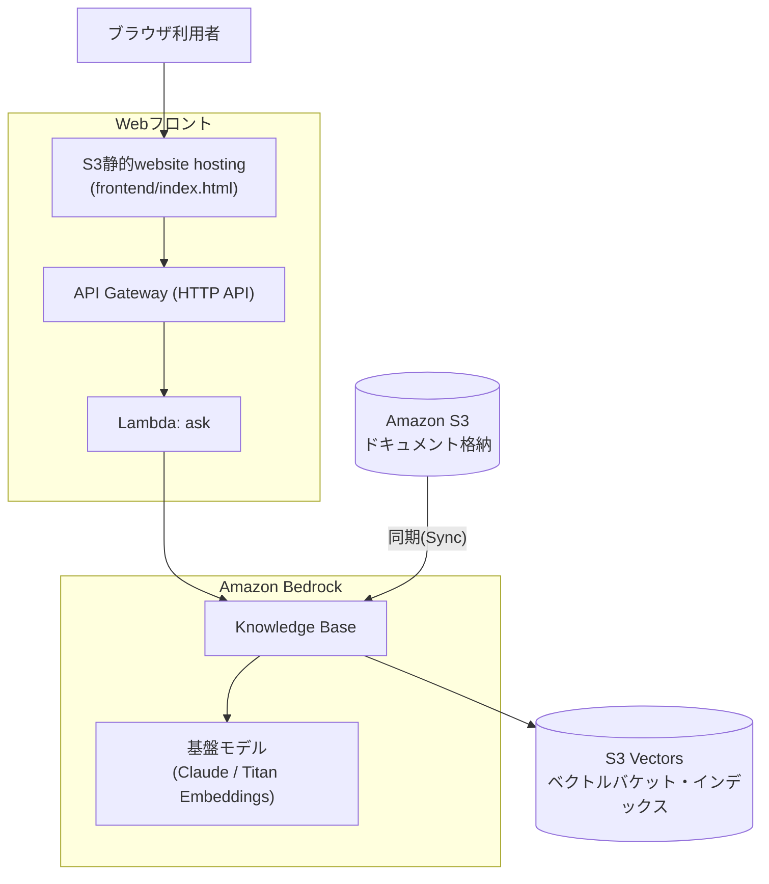

# ① 社内ナレッジAIチャットボット

社内資料をS3に集約し、低コストなAmazon S3 Vectorsをベクトルストアに用いたAmazon Bedrock Knowledge Basesでベクトル検索可能なAIチャットボットを構築する。ワークショップで出たアイデアを集約・選定した結果として、この構成を採用する。**45〜60分**で構築できる最小構成を想定している。

旅行予約・保険といった特定業務ではなく、**社内業務処理（経費精算・在宅勤務規定など）に関する問い合わせに答える汎用の社内ナレッジチャットボット**が題材（`sample-docs/`参照）。

この構成は[quest-aws-chatbot](../quest-aws-chatbot)（Aurora・複数パターン・Amplifyフロントエンドまで作り込んだ発展版）の**Basic共通版**にあたる。まずはこちらで最小構成を体験し、時間が余ったチームは発展版の追加ワーク（パターン①②）に進む想定。

**使用サービス**: Amazon S3 / Amazon S3 Vectors / Amazon Bedrock Knowledge Bases / Titan Embeddings / Claude（Bedrock）/ IAM

**主要手順（概要）**
1. S3バケットを作成し、社内資料（PDF・Word・テキスト）をアップロードする
2. Bedrockコンソールで「ナレッジベース」を新規作成し、データソースにS3バケットを指定する
3. 埋め込みモデル（Titan Embeddings）とベクトルストア（Amazon S3 Vectors）を選択し、同期を実行する
4. Webフロントエンド（下記「Webフロントで動作確認する」参照）から質問を入力し、回答を確認する

画面遷移レベルの詳細手順は下記「手順（コンソール操作）」を参照。

### 推奨アーキテクチャ（S3 Vectors版）



### 使用するAWSサービス／リソース一覧

| サービス | 役割 | 備考 |
|---|---|---|
| Amazon S3 | 元データ（ドキュメント）の格納 | 公開設定禁止 |
| Amazon S3 Vectors | ベクトルストア（埋め込みベクトルの保存先） | 保存量・クエリ課金で低コスト。OpenSearch Serverlessのような常時起動コストが発生しない |
| Amazon Bedrock Knowledge Base | RAGの中核。Embedding・検索・回答生成を統合 | 最小工数で構築可 |
| 基盤モデル（Claude等） | 回答生成・埋め込み生成 | 事前にモデルアクセスの有効化が必要 |
| IAM ロール | Knowledge BaseがS3・S3 Vectors・基盤モデルを操作するための権限 | 最小権限で付与 |

## 禁止事項（社内ルール／セキュリティ観点）

- ❌ S3バケット・S3 Vectorsバケットの公開設定（パブリックアクセス）
- ❌ 機密度の高い実データ・個人情報のアップロード（デモ用データのみ使用）
- ❌ IAMの過剰権限（`AdministratorAccess`等）の安易な付与
- ❌ サンドボックス環境外のリソースへのアクセス
- ❌ APIキー・認証情報のハードコーディング／外部共有

## 手順（マネジメントコンソール操作）

※ コンソールの画面・メニュー名はAWSのアップデートにより変わることがある。表示が異なる場合は名称の近いメニューを探すこと。

### 1. S3バケットを作成し、ドキュメントをアップロードする

1. マネジメントコンソールで **S3** を開く
2. 左メニュー「General purpose buckets」→ **「バケットを作成」**
3. バケット名を入力（例: `<チーム名>-documents`、全世界で一意な名前が必要）。リージョンはハンズオン共通のリージョン（例: 東京 ap-northeast-1）を選択
4. 「このバケットのブロックパブリックアクセス設定」は**デフォルトのまま（すべてブロック）**にする
5. 「バケットを作成」をクリック
6. 作成したバケットを開き、**「アップロード」→「ファイルを追加」**で社内ドキュメント（Markdown/PDF/Word等）を選択し、**「アップロード」**を実行する。サンプルとして本リポジトリの`sample-docs/`（経費精算規定・在宅勤務規定・画面仕様書サンプル）を使ってもよい

### 2. S3 Vectorsのベクトルバケット・インデックスを作成する

1. S3コンソールの左メニュー「Vector buckets」を開く（「General purpose buckets」と並んで表示される）
2. **「ベクトルバケットを作成」**をクリックし、バケット名を入力（例: `<チーム名>-vectors`）。暗号化はデフォルト（SSE-S3）のままでよい → 作成
3. 作成したベクトルバケットを開き、**「インデックス」タブ →「ベクトルインデックスを作成」**
4. 以下を入力する
   - **インデックス名**: 任意（例: `kb-index`）
   - **次元数（dimension）**: 使用する埋め込みモデルに合わせる。Titan Text Embeddings V2なら`1024`（下記「補足」参照）
   - **距離指標（distance metric）**: コサイン類似度（cosine）でよい
   - **メタデータ設定（non-filterable metadata keys）**: `AMAZON_BEDROCK_TEXT` と `AMAZON_BEDROCK_METADATA` の**2つを両方**追加する（★重要。詳細は下記「つまづきポイント」参照。ここを省略すると同期がほぼ全件失敗する）
5. 「ベクトルインデックスを作成」をクリック

### 3. Bedrockのモデルアクセスを有効化する

1. マネジメントコンソールで **Amazon Bedrock** を開く
2. 左メニュー下部の**「モデルアクセス」**をクリック
3. **「モデルアクセスを管理」**（または「特定のモデルを有効にする」）をクリック
4. 埋め込みモデル（**Titan Text Embeddings V2**）と回答生成モデル（**Claude**、選択可能なバージョンでよい）にチェックを入れる
5. 「次へ」→ 利用規約を確認し**「送信」**。ステータスが「アクセス許可済み」になるまで数分待つ

### 4. Bedrock Knowledge Baseを作成する

1. Bedrockコンソール左メニューの**「Knowledge Bases」**（Builder toolsの中）を開き、**「作成」→「ナレッジベースを作成」**
2. ナレッジベース名を入力
3. **IAM権限**: 「新しいサービスロールを作成して使用する」（推奨、必要な権限が自動付与される）を選択
4. データソースのタイプで**「S3」**を選択 → 次へ
5. データソース名を入力し、**S3 URI**で手順1で作成したバケットを指定（「参照」から選択可能）
6. チャンク戦略・パース戦略はデフォルトのままでよい → 次へ
7. **埋め込みモデル**: 「Titan Text Embeddings V2」を選択し、埋め込みの次元数を手順2のベクトルインデックスと**同じ値（例: 1024）**に設定する
8. **ベクトルストア**: 「既存のベクトルストアを使用する」→ ストアの種類で**「Amazon S3 Vectors」**を選択し、手順2で作成したベクトルバケット・ベクトルインデックスを指定する
9. 「次へ」で設定内容を確認し、**「ナレッジベースを作成」**をクリック（作成に数十秒〜1分程度かかる）

### 5. データソースを同期（Sync）する

1. 作成したKnowledge Baseの詳細画面を開く
2. 「データソース」欄で対象のデータソースにチェックを入れ、**「同期」**ボタンをクリック
3. ステータスが「同期中」→「使用可能」（Available/Ready）になるまで待つ（ドキュメント数が少なければ数十秒程度）

### 6. 動作確認する

Bedrockコンソールのテスト画面は使わず、Webフロントエンド（下記「Webフロントで動作確認する」参照、`terraform apply`で自動デプロイされる）またはcurlでのAPI直接呼び出しで動作確認する。

1. Webフロントエンド（`frontend_url`出力のURL）を開くか、`curl -X POST https://<api_endpoint>/ask -d '{"question": "在宅勤務は週に何日まで使えますか？"}'`を実行する
2. アップロードしたドキュメントの内容に基づいて回答が返ること、回答と一緒に**出典（ソースのURI）**も返ることを確認する

## 問い合わせ例

後述のWebフロント・curlから試せる質問例。現在取り込んでいる文書（`sample-docs/`）の内容に基づく。

### 取り込みドキュメント一覧

Knowledge Baseに実際に取り込まれている（≒`terraform/s3.tf`がS3へ自動アップロードする）ドキュメント。

| ファイル | 内容 |
|---|---|
| `sample-docs/01_expense_policy.md` | 経費精算規定（社内サンプル） |
| `sample-docs/02_remote_work_policy.md` | 在宅勤務規定（社内サンプル） |
| `sample-docs/03_screen_spec_booking.pdf` | 旅行予約サイトの画面仕様書サンプル（旅行検索〜予約完了までの5画面。スキャン画像PDFのため`BEDROCK_FOUNDATION_MODEL`パースで読み取る） |
| `sample-docs/gov/*.pdf`（16件） | 観光庁公開の旅行業法関連規定（標準旅行業約款・OTAガイドライン等）。個別の出典は[sample-docs/gov/README.md](sample-docs/gov/README.md)参照 |
| `sample-docs/gov/exam/*.pdf`（10件） | 地域限定旅行業務取扱管理者試験の過去問題（平成30年度〜令和4年度、問題・正解）。個別の出典は[sample-docs/gov/exam/README.md](sample-docs/gov/exam/README.md)参照 |

以下はKBには取り込まれない（`terraform/s3.tf`が`*.md`/`*.pdf`のみを対象とし、`README.md`は明示的に除外しているため）。

| ファイル | 位置づけ |
|---|---|
| `sample-docs/03_screen_spec_booking.xlsx` | 画面仕様書の元データ（スクショ貼付Excel）。参考資料 |
| `sample-docs/gov/README.md` / `sample-docs/gov/exam/README.md` | 出典管理用のメタ文書 |

**社内業務（経費精算・在宅勤務）**
- 経費精算はどのように申請すればいいですか？
- 経費精算の申請期限はいつまでですか？
- 取引先との会食費はいくらまで精算できますか？
- 領収書がない経費は精算できますか？
- 在宅勤務は週に何日まで使えますか？
- 在宅勤務の事前申請はいつまでに必要ですか？
- 海外からの在宅勤務は可能ですか？
- 在宅勤務手当はいくらですか？

**旅行業法・規定（観光庁公開資料、`sample-docs/gov/`）**
- 標準旅行業約款とは何ですか？
- 募集型企画旅行契約と受注型企画旅行契約の違いは何ですか？
- 旅行業法施行規則で観光庁長官が定める区域とはどのような場所ですか？
- オンライン旅行取引の表示等に関するガイドライン（OTAガイドライン）ではどのような表示が求められていますか？
- インターネット取引を利用する旅行業務について、どのような取扱いが定められていますか？
- 旅行業法第2条に規定する「旅行業」とはどのような業務を指しますか？
- 自治体が関与するツアーの実施は旅行業法上どのように扱われますか？
- 旅行業務及び旅行サービス手配業務におけるテレワークの実施基準を教えてください
- 第三種旅行業務及び地域限定の範囲はどのように定められていますか？
- 旅行業法における申請に対する処分の審査基準・標準処理期間はどうなっていますか？

**画面仕様書（旅行予約サイトの予約入力UIサンプル、`sample-docs/03_screen_spec_booking.pdf`）**
- 旅行検索画面ではどんな条件で検索できますか？
- プラン一覧画面から予約者情報入力画面へはどうやって進みますか？
- 予約者情報入力画面にはどんな入力項目がありますか？
- 同行者の氏名はどの画面で入力しますか？
- 代表者のフリガナは必須項目ですか？
- 特記事項の入力欄はどの画面にありますか？車椅子利用の申し送りはできますか？
- お支払い方法にはどのような選択肢がありますか？
- お支払い方法にクレジットカードを選んだ場合、追加で入力が必要な項目は何ですか？
- 標準旅行業約款への同意はどの画面で取得していますか？同意しないと予約できませんか？
- 予約を確定すると次にどの画面に遷移しますか？
- 予約番号はどのような形式で発行されますか？
- 予約完了画面ではどんな操作ができますか？
- 予約内容の確認メールはどこから再送できますか？
- SCR-003（予約者情報入力画面）からSCR-002（プラン一覧画面）へ戻ることはできますか？

**旅行業務取扱管理者試験（過去問、`sample-docs/gov/exam/`）**
- 地域限定旅行業務取扱管理者試験にはどのような科目がありますか？
- 令和4年度の試験問題にはどのような内容が含まれていますか？
- 旅程管理研修の内容及び方法の基準はどうなっていますか？
- 旅行サービス手配業務取扱管理者研修の内容を教えてください
- 地域限定旅行業務取扱管理者試験の合格基準は何点ですか？
- 令和2年度と令和3年度の試験内容にはどのような違いがありますか？

**会話継続（マルチターン）について**

現在の実装（`retrieve` + `converse`）は文脈を保持しないため、以下のような指示語を含む続けての質問には対応できない（既知の制約。詳細は下記「`sessionId`とマルチターン対応について」参照）。
```
1. 経費精算の申請期限はいつまでですか？
2. （続けて）それは何日以内ですか？ ← 1.の文脈を踏まえた回答にはならない
```

## つまづきポイントとヒント

| つまづきポイント | ヒント |
|---|---|
| データをどこに置く？ | まずS3バケットを作成しドキュメントをアップロードする |
| ベクトルの保存先は？ | S3ベクトルバケット（Vector bucket）を作成する |
| ベクトルインデックスは？ | ベクトルバケット内にベクトルインデックスを作成する（次元数は選択する埋め込みモデルに合わせる） |
| 検索させたい | Bedrock Knowledge Baseを作成し、データソースにS3を指定する |
| データソース設定 | データソースにドキュメント用S3バケットを指定する |
| データを反映したい | 作成後「同期（Sync）」を実行してベクトル化・格納する |
| モデルが使えない | 事前にBedrockのモデルアクセス（埋め込み／生成モデル）を有効化する |
| 動作確認したい | Knowledge Baseの「テスト」画面でチャット確認する |
| 権限エラーが出る | IAMロールにS3読み取り＋S3 Vectors操作＋Bedrock実行権限を付与する |
| **同期がほぼ全件失敗する（★重要）** | ベクトルインデックスの`non-filterable metadata keys`に`AMAZON_BEDROCK_TEXT`と`AMAZON_BEDROCK_METADATA`の両方を含めているか確認する。片方だけだと「フィルタ可能メタデータは1ベクトルあたり2048バイトまで」という制限にすぐ達し、ほとんどのチャンクが取り込み失敗する（実機検証で確認済みの実例） |
| Excelにスクショを貼り付けた仕様書を取り込みたい | そのままアップロードしてもセル内画像は認識されない。PDFにエクスポートしてから取り込む（詳細は下記「補足」参照） |

### 補足: Excel（スクショ貼り付け）の画面仕様書を取り込む場合の注意

画面仕様書のように「Excelにスクリーンショット画像を貼り付けた」ドキュメントは社内でよく使われる形式だが、そのままS3にアップロードしてもBedrock KBの標準パーサーはセルに貼り付けた画像を認識できず、テキスト（セルの文字値）だけが抽出されて画像の内容は失われる。

**対処法**: 取り込み前にPDFへエクスポートする。PDF化すると各ページが画像として扱われるため、本リポジトリで既に設定している`BEDROCK_FOUNDATION_MODEL`パース戦略（[terraform/bedrock_kb.tf](terraform/bedrock_kb.tf)）により、スクリーンショット内の文言までモデルが読み取ってテキスト化してくれる（`sample-docs/gov/`のスキャン画像PDFと同じ仕組み）。

サンプルとして、旅行予約サイトの予約入力UI（旅行検索〜予約完了までの5画面）の画面仕様書を以下の2つの形式で用意している。

| ファイル | 位置づけ |
|---|---|
| `sample-docs/03_screen_spec_booking.xlsx` | 元データ（実際にスクリーンショット画像をセルへ貼り付けたExcel）。参考資料として同梱、KBには取り込まない |
| `sample-docs/03_screen_spec_booking.pdf` | 上記をPDFエクスポートしたもの。KBの取り込み対象（`terraform/s3.tf`が`*.md`/`*.pdf`のみをS3へ自動アップロードするため、xlsxのままでは対象外） |

### 補足: 埋め込みモデルと次元数の対応

ベクトルインデックス作成時に**次元数（dimension）**の指定が必要。ここがKnowledge Base側で選んだ埋め込みモデルの次元数と不一致だと同期に失敗するため、重点的に確認すること。

| 埋め込みモデル例 | 次元数 |
|---|---|
| Amazon Titan Text Embeddings V2 | 1024 / 512 / 256（選択可） |
| Cohere Embed | 1024 |

## 追加ワークの技術補足（時間が余ったチーム向け）

- **パターン①: ナレッジベースの分岐** — Bedrockで複数のKnowledge Baseを用途別（仕様書系／チケット系等）に作成するか、1つのKB内でメタデータフィルタリングにより分岐させる
- **パターン②: データ種別で処理を分岐** — Excel等の構造化データはAmazon Athena／RDS等でSQLクエリ、パワポ・画像等の非構造化データはKnowledge Base（RAG）で検索する。ルーティング判定にはLambdaまたはBedrock Agentを利用する

より作り込んだ実装例（Terraformでの完全自動化・Aurora+Bedrock Agentによる自律ルーティング等）は[quest-aws-chatbot](../quest-aws-chatbot)を参照。

## ディスカッション想定キーワード（運営向け）

「なぜこのままでは本番運用に乗せられないか」を議論する際の想定キーワード。

| 論点 | 想定キーワード |
|---|---|
| データ更新の問題 | 実データはBox等の社内システムに格納されており、手動アップロードが必要 |
| 鮮度の問題 | 新情報の自動連携ができていない |
| コスト | 本構成はS3 Vectorsのため低コストだが、OpenSearch Serverless等を選ぶ場合は常時稼働コストが論点になる |
| セキュリティ／権限 | 誰がアクセスできるかの制御 |
| 解決の方向性 | 自動連携（Box→S3等）の実現には、Box管理者との連携調整が別途発生する |

## Webフロントで動作確認する

Bedrockコンソールのテスト画面は使わず、ブラウザから質問できる**Amplifyではなく、S3の静的website hosting**で配信する軽量なフロントで動作確認する（`terraform/`で自動デプロイされる、構成図は上記「推奨アーキテクチャ」を参照）。ビルドパイプラインを持たないHTML1枚構成のため、Amplifyより単純・低コスト。

- `frontend/index.html` — プレーンHTML+JS（ビルド不要）のチャット画面
- `lambda_function.py` + API Gateway（`POST /ask`）— Knowledge Baseを`Retrieve`で検索し、その結果をもとに`Converse`で回答を生成する薄いLambda
- フロント用S3バケットのみ公開設定（ドキュメント用バケットは非公開のまま）

## `lambda_function.py`の解説

このリポジトリで唯一のLambda関数。コードブロックごとに解説する。

### インポートとクライアント初期化

```python
import json
import os
import uuid

import boto3

bedrock_agent_runtime = boto3.client("bedrock-agent-runtime")
bedrock_runtime = boto3.client("bedrock-runtime")

KNOWLEDGE_BASE_ID = os.environ["KNOWLEDGE_BASE_ID"]
MODEL_ARN = os.environ["MODEL_ARN"]
```

- `boto3.client("bedrock-agent-runtime")`はKnowledge Baseへの検索（`retrieve`）専用のAPIクライアント。`boto3.client("bedrock-runtime")`は基盤モデルの呼び出し（`converse`）専用のクライアントで、両者は別物である点に注意（KB自体の作成・管理を行う`bedrock-agent`ともさらに別）
- 当初は`bedrock_agent_runtime.retrieve_and_generate()`のみで検索と生成をまとめて行っていたが、本リポジトリで作成するKnowledge Baseは**マネージド型（ベクトルストアの管理をAWSに一任するタイプ）**であり、`RetrieveAndGenerate`APIはマネージド型では未対応（`ValidationException: This operation is not supported for managed knowledge bases`）。そのため「検索は`retrieve`、生成は`converse`」の2段階に分離している
- `KNOWLEDGE_BASE_ID`・`MODEL_ARN`はLambdaの環境変数から取得する（`terraform/api.tf`でLambdaリソースに設定済み）。ハードコーディングせず環境変数経由にすることで、KBやモデルを差し替えてもコード変更なしで対応できる
- クライアントの初期化をハンドラー関数の外（モジュールレベル）で行っているのは、Lambdaの実行環境が再利用される際（コールドスタートではない2回目以降の呼び出し）にクライアントを使い回し、初期化コストを省くため

### システムプロンプト

```python
SYSTEM_PROMPT = """あなたはJTB情報管理ツールに関する社内ナレッジチャットボットです。以下の検索結果のみを根拠に、ユーザーの質問に日本語で回答してください。検索結果に答えがない場合は、その旨を伝えてください。

JTB情報管理ツールの手続き・申請フロー・プロセスに関する質問(例:「〜の申請手順は?」「〜の流れを教えて」)の場合は、回答の最後にMermaid記法のフローチャートを ```mermaid ``` のコードブロックで追加してください。単純な事実確認の質問には無理にフローチャートを付けないでください。"""
```

- `RetrieveAndGenerate`を使っていた頃は`$search_results$`・`$output_format_instructions$`というBedrock側の予約プレースホルダーを含んだプロンプトテンプレートを渡す必要があったが、`converse`は単なるチャットAPIなのでその制約はない。検索結果は下記`_generate_answer`内でユーザーメッセージに直接埋め込む
- Mermaidフローチャートを促す指示文は従来どおり（詳細は下記「回答内のMermaidフローチャート自動生成」参照）

### `_retrieve` — Knowledge Base検索

```python
def _retrieve(question: str) -> list[dict]:
    response = bedrock_agent_runtime.retrieve(
        knowledgeBaseId=KNOWLEDGE_BASE_ID,
        retrievalQuery={"text": question},
        retrievalConfiguration={
            "managedSearchConfiguration": {"numberOfResults": 6},
        },
    )
    return response.get("retrievalResults", [])
```

- `retrieve`はKnowledge Baseに対して検索のみを行うAPI（生成は行わない）。`numberOfResults`で取得するチャンク数の上限を指定する（多すぎるとプロンプトが肥大化してコスト・レイテンシが増え、少なすぎると根拠不足になるためのトレードオフ）
- `retrievalConfiguration`は`vectorSearchConfiguration`（Customer-managed型。自前のOpenSearch Serverless等を使う場合）と`managedSearchConfiguration`（Managed型。本リポジトリで作成しているのはこちら）の2種類があり、KBの種類に合わない方を指定すると`ValidationException`になる。フィールド名は違うが中身（`numberOfResults`等）はほぼ同じ
- 戻り値の各要素は`content.text`（チャンク本文）と`location.s3Location.uri`（出典）などを持つ

### `_build_search_results_text` / `_generate_answer` — プロンプト組み立てと回答生成

```python
def _build_search_results_text(results: list[dict]) -> str:
    blocks = []
    for i, r in enumerate(results, start=1):
        text = r.get("content", {}).get("text", "")
        uri = r.get("location", {}).get("s3Location", {}).get("uri", "")
        blocks.append(f"[検索結果{i}] (出典: {uri})\n{text}")
    return "\n\n".join(blocks) if blocks else "(該当する検索結果はありませんでした)"


def _generate_answer(question: str, search_results_text: str) -> str:
    user_message = f"検索結果:\n{search_results_text}\n\n質問:\n{question}"
    response = bedrock_runtime.converse(
        modelId=MODEL_ARN,
        system=[{"text": SYSTEM_PROMPT}],
        messages=[{"role": "user", "content": [{"text": user_message}]}],
    )
    return response["output"]["message"]["content"][0]["text"]
```

- `_build_search_results_text`は、`RetrieveAndGenerate`がBedrock内部で自動的にやっていた「検索結果をプロンプトに整形する」処理を自前で行う部分。各チャンクに出典URIを添えて番号付きで並べる
- 検索結果が0件（該当ドキュメントなし）の場合でも空文字列を渡さず、「該当する検索結果はありませんでした」という文言を入れることで、モデルが検索結果欄を無視して幻覚（hallucination）で答えてしまうリスクを減らしている
- `_generate_answer`は`converse` APIで、`system`にシステムプロンプト、`messages`に検索結果込みのユーザーメッセージを渡して回答を生成する。`converse`はBedrockの複数モデル間で共通化された会話APIで、モデルごとに異なる`invoke_model`のリクエスト形式を意識せずに済む

### `ask_knowledge_base` — 検索・生成・出典抽出の統合

```python
def ask_knowledge_base(question: str, session_id: str | None) -> dict:
    results = _retrieve(question)
    search_results_text = _build_search_results_text(results)
    answer = _generate_answer(question, search_results_text)

    sources = sorted({
        r["location"]["s3Location"]["uri"]
        for r in results
        if "s3Location" in r.get("location", {})
    })
    return {
        "answer": answer,
        "sources": sources,
        "sessionId": session_id or str(uuid.uuid4()),
    }
```

- **出典の抽出**: `RetrieveAndGenerate`時代は回答の`citations`（実際に回答に使われた根拠のみ）から出典を抽出していたが、`retrieve`+`converse`構成ではモデルの回答と検索結果が別APIの戻り値になるため、正確な対応付けはできない。代わりに`_retrieve`で取得した検索結果全件（＝回答生成のプロンプトに含めたチャンク全て）を出典として返している。`{...}`という集合内包表記で重複を自動的に除去し、`sorted()`で並び順を安定させている
- **`sessionId`について（重要な制約）**: `retrieve`・`converse`はいずれもステートレスなAPIで、`RetrieveAndGenerate`が持っていたような「Bedrock側で会話履歴を保持する`sessionId`」の仕組みは存在しない。ここで返している`sessionId`はフロントエンドとのインターフェース（レスポンス形状）を変えずに済ませるための識別子にすぎず、**次の質問に渡しても文脈は一切引き継がれない**。「それは何日以内ですか？」のような指示語を含む質問には対応できなくなっている点に注意（マルチターン対応を実装する場合は、フロントから会話履歴を送る、あるいはDynamoDB等で履歴を管理して`converse`の`messages`に積み直す、といった作り込みが別途必要）

### `_response` — API Gatewayレスポンスの整形

```python
def _response(status_code: int, body: dict) -> dict:
    return {
        "statusCode": status_code,
        "headers": {
            "Content-Type": "application/json",
            "Access-Control-Allow-Origin": "*",
        },
        "body": json.dumps(body, ensure_ascii=False),
    }
```

- API Gatewayの**Lambdaプロキシ統合**（`payload_format_version = "2.0"`）が期待する形式（`statusCode`・`headers`・`body`を持つ辞書）にレスポンスを整形するだけの小さなヘルパー
- `Access-Control-Allow-Origin: *`はCORS対応。S3静的website hostingのオリジンとAPI Gatewayのオリジンが異なる（別ドメイン）ため、これがないとブラウザがレスポンスをブロックする
- `json.dumps(..., ensure_ascii=False)`により、日本語をUnicodeエスケープ（`\uXXXX`）せずそのままUTF-8で出力する（可読性のため）

### `lambda_handler` — エントリポイント

```python
def lambda_handler(event, context):
    body = json.loads(event.get("body") or "{}")
    question = (body.get("question") or "").strip()
    if not question:
        return _response(400, {"error": "question is empty"})

    session_id = body.get("sessionId") or None
    result = ask_knowledge_base(question, session_id)
    return _response(200, result)
```

- API Gatewayから渡される`event`の`body`（JSON文字列）をパースする。`body`が存在しない場合に備え`"{}"`をデフォルト値にしている
- `question`が空文字列（キー自体がない場合も含む）なら、Bedrockを呼ばずに`400`エラーを即座に返す（不要なAPI呼び出し・課金を避ける）
- `sessionId`は任意項目（`body.get("sessionId") or None`で、キーがない・空文字列のどちらでも`None`に正規化する）
- 最終的に`ask_knowledge_base`の結果（`answer`・`sources`・`sessionId`）をそのまま`200`で返す

**API Gatewayの種類（HTTP API vs REST API）**: 本リポジトリはHTTP APIを採用している。

| 観点 | HTTP API | REST API |
|---|---|---|
| リクエスト単価 | 安い（東京リージョンで約$1.00/100万リクエスト） | 高い（約$3.50/100万リクエスト、HTTP APIの約3.5倍） |
| レイテンシ | 低い（軽量な実装） | やや高い |
| CORS設定 | `cors_configuration`ブロック1つで完結（本リポジトリの現状） | OPTIONSメソッド・統合レスポンスを個別に手動設定する必要がある |
| 認証方式 | JWT authorizer / IAM / Lambda authorizer | Cognitoユーザープール / IAM / Lambda authorizer / リソースポリシー |
| APIキー・使用量プラン（レート制限等） | 非対応 | 対応（`aws_api_gateway_usage_plan`等） |
| リクエスト/レスポンス変換（マッピングテンプレート） | 非対応 | 対応（VTLでの変換が可能） |
| リクエストバリデーション | 非対応（Lambda側で自前実装が必要） | JSON Schemaベースの組み込みバリデーション対応 |
| キャッシュ | 非対応 | 対応（ステージ単位でキャッシュ設定可能） |
| エンドポイントタイプ | リージョナルのみ | リージョナル／エッジ最適化（CloudFront経由）／プライベート（VPCエンドポイント） |
| WAF統合 | 対応 | 対応 |

`POST /ask`のみの単純なチャットAPIで、APIキー・使用量プラン・キャッシュ・プライベートエンドポイントのいずれも要件になければ、HTTP APIの低コスト・低レイテンシの優位性がそのまま活きるため、これらのREST API専用機能が必要になった場合にのみ切り替えを検討する。

```bash
curl -X POST https://<api_endpoint>/ask \
  -H "Content-Type: application/json" \
  -d '{"question": "在宅勤務は週に何日まで使えますか？"}'
```

`terraform apply`後の`frontend_url`出力（`http://`を付けてブラウザで開く）から動作確認できる。

**`sessionId`とマルチターン対応について（既知の制約）**: 以前は`RetrieveAndGenerate`API標準の`sessionId`機能を使い、DynamoDB等の追加インフラなしで会話の文脈を保持していた。しかし本リポジトリのKnowledge Baseは**マネージド型**であり`RetrieveAndGenerate`自体が使えないため、現在の`retrieve`+`converse`構成ではこの機能は失われている。

- レスポンスの`sessionId`はフロントとのインターフェースを保つために返しているだけの識別子で、次のリクエストに含めても**文脈は一切引き継がれない**（Lambda側は`question`のみを見て毎回独立に検索・生成している）
- そのため「それは何日以内ですか？」のような指示語を含む続けての質問には正しく回答できない。試す場合は毎回、指示語を使わず質問を完結させること

マルチターン対応が必要になった場合の主な選択肢:

| 方式 | 実装コスト | 会話ログの監査 | 備考 |
|---|---|---|---|
| フロントから直近の会話履歴を送る | 低い（`converse`の`messages`に積むだけ） | 不可 | ブラウザを閉じると履歴は消える。手軽だが規模が増えると素朴には限界がある |
| DynamoDBで履歴を管理 | 高い（履歴の保存・取得・`messages`への組み込みを自前実装） | 可能 | TTLで保持期間を制御可能。品質レビュー・利用状況分析にも使える |

いずれも今回のスコープでは未実装。必要になった時点で追加検討する。

**回答内のMermaidフローチャート自動生成**: 「経費精算の申請手順を教えてください」のような手続き・フローに関する質問には、テキストの回答に加えてMermaid記法のフローチャートも自動生成される。これは2つの仕組みの組み合わせで実現している。

1. **プロンプトエンジニアリング（`lambda_function.py`）**: `converse`に渡す`SYSTEM_PROMPT`に、「手続き・申請フロー・プロセスに関する質問の場合は、回答の最後にMermaid記法のフローチャートを ` ```mermaid ``` ` のコードブロックで追加してください」という指示を明示的に加えることで、Claude自身が持つMermaid記法の生成能力（学習データに技術文書由来のMermaid記法が含まれているため、指示すれば正しい構文で書ける）を引き出している。何も指示しなければ、モデルは普通のテキストだけで回答し、図は出力しない。
2. **フロントエンドでの描画（`frontend/index.html`）**: モデルの回答はあくまで ` ```mermaid ... ``` ` というプレーンテキストとして返ってくるだけなので、ブラウザ側でこのコードブロックを検出し、[mermaid.js](https://mermaid.js.org/)（CDNから動的importで読み込み）を使って実際の図（SVG）に変換・描画している。CDN読み込みに失敗した場合はダイアグラム機能だけを諦め、チャット自体は通常通り動作するようにしている（静的importだとCDN障害時にスクリプト全体が止まってしまうため）。

この2つのうち片方が欠けても実現しない点に注意（プロンプト指示だけではブラウザ上でコードのまま表示され、フロント側の描画処理だけではモデルがそもそも図を生成しない）。

## オプション: Slackに組み込む（構想メモ、未実装）

Webフロントに加えてSlackからも質問できるようにする場合の実装方針。**現時点ではコード化していない**が、検討結果として記録しておく。

**Slack側の設定**
1. [api.slack.com](https://api.slack.com/apps)でSlack Appを作成する
2. 「Slash Commands」で例えば`/ask`コマンドを追加し、リクエストURLに`/ask`エンドポイントを指定する
3. 「Basic Information」から**Signing Secret**を取得する（リクエストが本物のSlackからかを検証するために必須）
4. ワークスペースにアプリをインストールする

**Lambda側で必要になる変更（現状は未実装）**
- Slackのスラッシュコマンドは`application/x-www-form-urlencoded`形式でPOSTされ、質問文は`text`パラメータに入る（現状の`lambda_function.py`はJSONボディの`question`しか読んでいない）
- レスポンスもSlackが期待する形式（`{"response_type": "in_channel", "text": "..."}`）に合わせる必要がある
- `X-Slack-Signature`・`X-Slack-Request-Timestamp`ヘッダーとSigning Secretを使った署名検証を追加し、なりすましリクエストを防ぐ

**注意点: Slackの3秒タイムアウト**

Slackはスラッシュコマンドに対して**3秒以内**にHTTPレスポンスを返さないと、ユーザーに「このコマンドは応答しませんでした」と表示してしまう。Bedrock KBの検索・生成（特にMermaidフローチャートを生成する質問）は3秒を超えることがあり、現状のような単一のLambda呼び出し内で完結させる実装だと、実際には正しく回答していてもSlack上ではタイムアウト表示になるリスクがある。

| 方式 | 概要 | メリット | デメリット |
|---|---|---|---|
| シンプル実装 | 現状の`/ask`と同じ1回のLambda呼び出しで即座に回答する | 実装が単純。既存コードの流用度が高い | 生成が3秒を超えるとSlack側にエラー表示が出る（実際の回答は裏で完了していても、Slack上はタイムアウト扱いになる） |
| 遅延応答パターン | ①スラッシュコマンド受信時にまず仮の確認応答を即座に返す→②裏で非同期にBedrock呼び出しを実行→③完了後にSlackから渡される`response_url`（30分間有効なWebhook）に結果をPOSTする | 3秒制限に引っかからない。本番運用に耐える正しい実装 | Lambdaの非同期呼び出し（自己呼び出しや2つ目のLambda）が必要になり、実装量が増える |

本番でSlack連携を有効にする場合は、遅延応答パターンでの実装を推奨する。

## この検証用Terraformについて

`terraform/`には、上記手順（Webフロント含む）が実際に機能することを**運営側が事前検証する**ための構成一式（S3バケット・S3 Vectors・Knowledge Base・IAMロール・Lambda・API Gateway・S3静的website hosting）を用意している。**参加者向けではなく、運営が事前にハンズオンの通り実施可能か確認する用途**。

`main`へのpushでGitHub Actionsが自動的に`terraform apply`するCI/CDも組んである（OIDC認証、長期アクセスキー不要）。詳細は[terraform/README.md](terraform/README.md)を参照。
