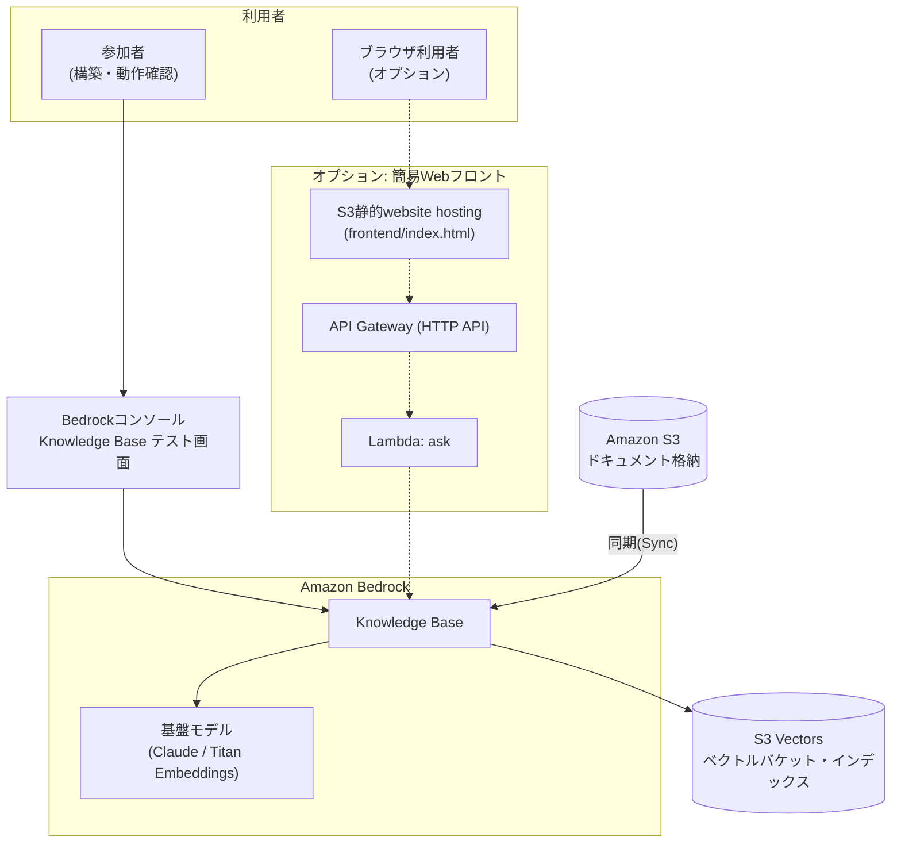

# ① 社内ナレッジAIチャットボット（対応: Aチーム）

社内資料をS3に集約し、低コストなAmazon S3 Vectorsをベクトルストアに用いたAmazon Bedrock Knowledge Basesでベクトル検索可能なAIチャットボットを構築する。Aチームのシステム化案「AIに資料を食わせて、チャットで回答をもらう」をそのまま実現する。**45〜60分**で構築できる最小構成を想定している。

旅行予約・保険といった特定業務ではなく、**社内業務処理（経費精算・在宅勤務規定など）に関する問い合わせに答える汎用の社内ナレッジチャットボット**が題材（`sample-docs/`参照）。

この構成は[quest-aws-chatbot](../quest-aws-chatbot)（Aurora・複数パターン・Amplifyフロントエンドまで作り込んだ発展版）の**Basic共通版**にあたる。まずはこちらで最小構成を体験し、時間が余ったチームは発展版の追加ワーク（パターン①②）に進む想定。

**使用サービス**: Amazon S3 / Amazon S3 Vectors / Amazon Bedrock Knowledge Bases / Titan Embeddings / Claude（Bedrock）/ IAM

**主要手順（概要）**
1. S3バケットを作成し、社内資料（PDF・Word・テキスト）をアップロードする
2. Bedrockコンソールで「ナレッジベース」を新規作成し、データソースにS3バケットを指定する
3. 埋め込みモデル（Titan Embeddings）とベクトルストア（Amazon S3 Vectors）を選択し、同期を実行する
4. Bedrockの「テストチャット」画面でナレッジベースを選び、資料に関する質問を入力して回答を確認する

画面遷移レベルの詳細手順は下記「手順（コンソール操作）」を参照。

### 推奨アーキテクチャ（S3 Vectors版）



実線＝必須構成（マネジメントコンソールだけで完結）、点線＝オプションのWebフロント（`terraform/`で検証済み、Amplifyではなく低コストなS3静的website hostingを採用）。

### 使用するAWSサービス／リソース一覧

| サービス | 役割 | 備考 |
|---|---|---|
| Amazon S3 | 元データ（ドキュメント）の格納 | 公開設定禁止 |
| Amazon S3 Vectors | ベクトルストア（埋め込みベクトルの保存先） | 保存量・クエリ課金で低コスト。OpenSearch Serverlessのような常時起動コストが発生しない |
| Amazon Bedrock Knowledge Base | RAGの中核。Embedding・検索・回答生成を統合 | 最小工数で構築可 |
| 基盤モデル（Claude等） | 回答生成・埋め込み生成 | 事前にモデルアクセスの有効化が必要 |
| IAM ロール | Knowledge BaseがS3・S3 Vectors・基盤モデルを操作するための権限 | 最小権限で付与 |

## 禁止事項（社内ルール／セキュリティ観点）

- ❌ S3バケット・S3 Vectorsバケットの公開設定（パブリックアクセス）
- ❌ 機密度の高い実データ・個人情報のアップロード（デモ用データのみ使用）
- ❌ IAMの過剰権限（`AdministratorAccess`等）の安易な付与
- ❌ サンドボックス環境外のリソースへのアクセス
- ❌ APIキー・認証情報のハードコーディング／外部共有
- ❌ ドキュメント用バケットとベクトルバケットの取り違え（役割を明確に分ける）

## 手順（マネジメントコンソール操作）

※ コンソールの画面・メニュー名はAWSのアップデートにより変わることがある。表示が異なる場合は名称の近いメニューを探すこと。

### 1. S3バケットを作成し、ドキュメントをアップロードする

1. マネジメントコンソールで **S3** を開く
2. 左メニュー「General purpose buckets」→ **「バケットを作成」**
3. バケット名を入力（例: `<チーム名>-documents`、全世界で一意な名前が必要）。リージョンはハンズオン共通のリージョン（例: 東京 ap-northeast-1）を選択
4. 「このバケットのブロックパブリックアクセス設定」は**デフォルトのまま（すべてブロック）**にする
5. 「バケットを作成」をクリック
6. 作成したバケットを開き、**「アップロード」→「ファイルを追加」**で社内ドキュメント（Markdown/PDF/Word等）を選択し、**「アップロード」**を実行する。サンプルとして本リポジトリの`sample-docs/`（経費精算規定・在宅勤務規定）を使ってもよい

### 2. S3 Vectorsのベクトルバケット・インデックスを作成する

1. S3コンソールの左メニュー「Vector buckets」を開く（「General purpose buckets」と並んで表示される）
2. **「ベクトルバケットを作成」**をクリックし、バケット名を入力（例: `<チーム名>-vectors`）。暗号化はデフォルト（SSE-S3）のままでよい → 作成
3. 作成したベクトルバケットを開き、**「インデックス」タブ →「ベクトルインデックスを作成」**
4. 以下を入力する
   - **インデックス名**: 任意（例: `kb-index`）
   - **次元数（dimension）**: 使用する埋め込みモデルに合わせる。Titan Text Embeddings V2なら`1024`（下記「補足」参照）
   - **距離指標（distance metric）**: コサイン類似度（cosine）でよい
   - **メタデータ設定（non-filterable metadata keys）**: `AMAZON_BEDROCK_TEXT` と `AMAZON_BEDROCK_METADATA` の**2つを両方**追加する（★重要。詳細は下記「つまづきポイント」参照。ここを省略すると同期がほぼ全件失敗する）
5. 「ベクトルインデックスを作成」をクリック

### 3. Bedrockのモデルアクセスを有効化する

1. マネジメントコンソールで **Amazon Bedrock** を開く
2. 左メニュー下部の**「モデルアクセス」**をクリック
3. **「モデルアクセスを管理」**（または「特定のモデルを有効にする」）をクリック
4. 埋め込みモデル（**Titan Text Embeddings V2**）と回答生成モデル（**Claude**、選択可能なバージョンでよい）にチェックを入れる
5. 「次へ」→ 利用規約を確認し**「送信」**。ステータスが「アクセス許可済み」になるまで数分待つ

### 4. Bedrock Knowledge Baseを作成する

1. Bedrockコンソール左メニューの**「Knowledge Bases」**（Builder toolsの中）を開き、**「作成」→「ナレッジベースを作成」**
2. ナレッジベース名を入力
3. **IAM権限**: 「新しいサービスロールを作成して使用する」（推奨、必要な権限が自動付与される）を選択
4. データソースのタイプで**「S3」**を選択 → 次へ
5. データソース名を入力し、**S3 URI**で手順1で作成したバケットを指定（「参照」から選択可能）
6. チャンク戦略・パース戦略はデフォルトのままでよい → 次へ
7. **埋め込みモデル**: 「Titan Text Embeddings V2」を選択し、埋め込みの次元数を手順2のベクトルインデックスと**同じ値（例: 1024）**に設定する
8. **ベクトルストア**: 「既存のベクトルストアを使用する」→ ストアの種類で**「Amazon S3 Vectors」**を選択し、手順2で作成したベクトルバケット・ベクトルインデックスを指定する
9. 「次へ」で設定内容を確認し、**「ナレッジベースを作成」**をクリック（作成に数十秒〜1分程度かかる）

### 5. データソースを同期（Sync）する

1. 作成したKnowledge Baseの詳細画面を開く
2. 「データソース」欄で対象のデータソースにチェックを入れ、**「同期」**ボタンをクリック
3. ステータスが「同期中」→「使用可能」（Available/Ready）になるまで待つ（ドキュメント数が少なければ数十秒程度）

### 6. テスト画面で動作確認する

1. Knowledge Base詳細画面の右側（または上部）にある**「ナレッジベースをテスト」**パネルを開く
2. 生成に使うモデル（Claude等）を選択する
3. 質問（例: 「在宅勤務は週に何日まで使えますか？」）を入力し、送信する
4. アップロードしたドキュメントの内容に基づいて回答が返ること、回答と一緒に**出典（ソースの詳細）**も表示されることを確認する

## つまづきポイントとヒント

| つまづきポイント | ヒント |
|---|---|
| データをどこに置く？ | まずS3バケットを作成しドキュメントをアップロードする |
| ベクトルの保存先は？ | S3ベクトルバケット（Vector bucket）を作成する |
| ベクトルインデックスは？ | ベクトルバケット内にベクトルインデックスを作成する（次元数は選択する埋め込みモデルに合わせる） |
| 検索させたい | Bedrock Knowledge Baseを作成し、データソースにS3を指定する |
| データソース設定 | データソースにドキュメント用S3バケットを指定する |
| データを反映したい | 作成後「同期（Sync）」を実行してベクトル化・格納する |
| モデルが使えない | 事前にBedrockのモデルアクセス（埋め込み／生成モデル）を有効化する |
| 動作確認したい | Knowledge Baseの「テスト」画面でチャット確認する |
| 権限エラーが出る | IAMロールにS3読み取り＋S3 Vectors操作＋Bedrock実行権限を付与する |
| **同期がほぼ全件失敗する（★重要）** | ベクトルインデックスの`non-filterable metadata keys`に`AMAZON_BEDROCK_TEXT`と`AMAZON_BEDROCK_METADATA`の両方を含めているか確認する。片方だけだと「フィルタ可能メタデータは1ベクトルあたり2048バイトまで」という制限にすぐ達し、ほとんどのチャンクが取り込み失敗する（実機検証で確認済みの実例） |

### 補足: 埋め込みモデルと次元数の対応

ベクトルインデックス作成時に**次元数（dimension）**の指定が必要。ここがKnowledge Base側で選んだ埋め込みモデルの次元数と不一致だと同期に失敗するため、重点的に確認すること。

| 埋め込みモデル例 | 次元数 |
|---|---|
| Amazon Titan Text Embeddings V2 | 1024 / 512 / 256（選択可） |
| Cohere Embed | 1024 |

## 追加ワークの技術補足（時間が余ったチーム向け）

- **パターン①: ナレッジベースの分岐** — Bedrockで複数のKnowledge Baseを用途別（仕様書系／チケット系等）に作成するか、1つのKB内でメタデータフィルタリングにより分岐させる
- **パターン②: データ種別で処理を分岐** — Excel等の構造化データはAmazon Athena／RDS等でSQLクエリ、パワポ・画像等の非構造化データはKnowledge Base（RAG）で検索する。ルーティング判定にはLambdaまたはBedrock Agentを利用する

より作り込んだ実装例（Terraformでの完全自動化・Aurora+Bedrock Agentによる自律ルーティング等）は[quest-aws-chatbot](../quest-aws-chatbot)を参照。

## ディスカッション想定キーワード（運営向け）

「なぜこのままでは本番運用に乗せられないか」を議論する際の想定キーワード。

| 論点 | 想定キーワード |
|---|---|
| データ更新の問題 | 実データはBox等の社内システムに格納されており、手動アップロードが必要 |
| 鮮度の問題 | 新情報の自動連携ができていない |
| コスト | 本構成はS3 Vectorsのため低コストだが、OpenSearch Serverless等を選ぶ場合は常時稼働コストが論点になる |
| セキュリティ／権限 | 誰がアクセスできるかの制御 |
| 解決の方向性 | 自動連携（Box→S3等）の実現には、Box管理者との連携調整が別途発生する |

## オプション: S3でシンプルなWebフロントを追加する

Bedrockコンソールのテストチャットだけでなく、ブラウザからも質問できるようにしたい場合は、**Amplifyではなく、S3の静的website hosting**で配信する軽量なフロントを追加できる（`terraform/`に検証済みで含まれている、構成図は上記「推奨アーキテクチャ」の点線部分）。ビルドパイプラインを持たないHTML1枚構成のため、Amplifyより単純・低コスト。

- `frontend/index.html` — プレーンHTML+JS（ビルド不要）のチャット画面
- `lambda_function.py` + API Gateway（`POST /ask`）— Knowledge BaseにRetrieveAndGenerateするだけの薄いLambda
- フロント用S3バケットのみ公開設定（ドキュメント用バケットは非公開のまま）

```bash
curl -X POST https://<api_endpoint>/ask \
  -H "Content-Type: application/json" \
  -d '{"question": "在宅勤務は週に何日まで使えますか？"}'
```

`terraform apply`後の`frontend_url`出力（`http://`を付けてブラウザで開く）から動作確認できる。

## この検証用Terraformについて

`terraform/`には、上記手順（Webフロント含む）が実際に機能することを**運営側が事前検証する**ための構成一式（S3バケット・S3 Vectors・Knowledge Base・IAMロール・Lambda・API Gateway・S3静的website hosting）を用意している。**参加者向けではなく、運営が事前にハンズオンの通り実施可能か確認する用途**。

`main`へのpushでGitHub Actionsが自動的に`terraform apply`するCI/CDも組んである（OIDC認証、長期アクセスキー不要）。詳細は[terraform/README.md](terraform/README.md)を参照。
