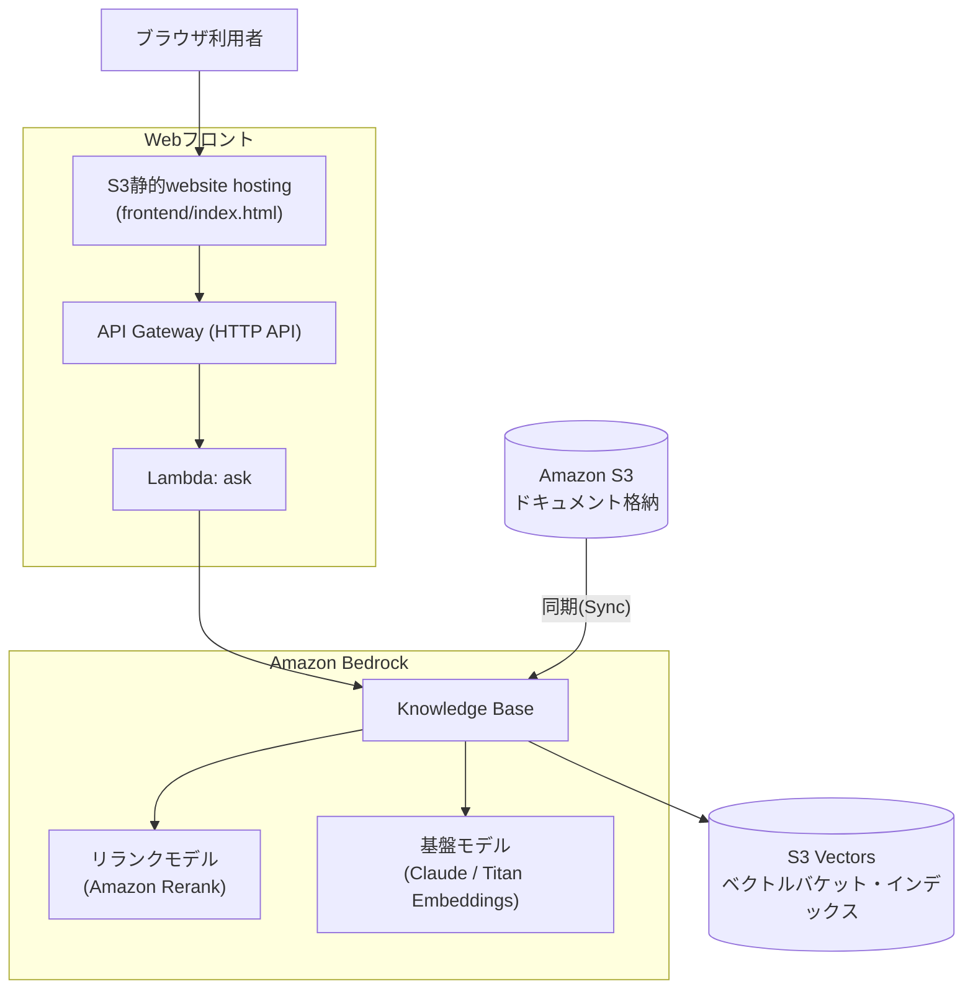

# ① Quest 社内ナレッジAIチャットボット

社内資料をS3に集約し、低コストなAmazon S3 Vectorsをベクトルストアに用いたAmazon Bedrock Knowledge Basesでベクトル検索可能なAIチャットボットを構築する。ワークショップで出たアイデアを集約・選定した結果として、この構成を採用する。**45〜60分**で構築できる最小構成を想定している。

特定の業種・業務に依存せず、社内文書（画面仕様書など）を根拠に問い合わせへ回答する**汎用の社内ナレッジチャットボット**が題材（`sample-docs/`参照）。

この構成は[quest-aws-chatbot](../quest-aws-chatbot)（Aurora・複数パターン・Amplifyフロントエンドまで作り込んだ発展版）の**Basic共通版**にあたる。まずはこちらで最小構成を体験し、時間が余ったチームは発展版の追加ワーク（パターン①②）に進む想定。

**使用サービス**: Amazon S3 / Amazon S3 Vectors / Amazon Bedrock Knowledge Bases / Titan Embeddings / Claude（Bedrock）/ IAM

**主要手順（概要）**
1. S3バケットを作成し、社内資料（PDF・Word・テキスト）をアップロードする
2. Bedrockコンソールで「ナレッジベース」を新規作成し、データソースにS3バケットを指定する
3. 埋め込みモデル（Titan Embeddings）とベクトルストア（Amazon S3 Vectors）を選択し、同期を実行する
4. Webフロントエンド（下記「Webフロントで動作確認する」参照）から質問を入力し、回答を確認する

画面遷移レベルの詳細手順は下記「手順（コンソール操作）」を参照。

### 推奨アーキテクチャ（S3 Vectors版）



### 使用するAWSサービス／リソース一覧

| サービス | 役割 | 備考 |
|---|---|---|
| Amazon S3 | 元データ（ドキュメント）の格納 | 公開設定禁止 |
| Amazon S3 Vectors | ベクトルストア（埋め込みベクトルの保存先） | 保存量・クエリ課金で低コスト。OpenSearch Serverlessのような常時起動コストが発生しない |
| Amazon Bedrock Knowledge Base | RAGの中核。Embedding・検索・回答生成を統合 | 最小工数で構築可 |
| 基盤モデル（Claude等） | 回答生成・埋め込み生成 | 事前にモデルアクセスの有効化が必要 |
| リランクモデル（Amazon Rerank） | 検索結果の並べ替え（reranking） | 事前にモデルアクセスの有効化が必要 |
| IAM ロール | Knowledge BaseがS3・S3 Vectors・基盤モデルを操作するための権限 | 最小権限で付与 |

## 禁止事項（社内ルール／セキュリティ観点）

- ❌ S3バケット・S3 Vectorsバケットの公開設定（パブリックアクセス）
- ❌ 機密度の高い実データ・個人情報のアップロード（デモ用データのみ使用）
- ❌ IAMの過剰権限（`AdministratorAccess`等）の安易な付与

## 手順（マネジメントコンソール操作）

※ コンソールの画面・メニュー名はAWSのアップデートにより変わることがある。表示が異なる場合は名称の近いメニューを探すこと。

### 1. S3バケットを作成し、ドキュメントをアップロードする

1. マネジメントコンソールで **S3** を開く
2. 左メニュー「General purpose buckets」→ **「バケットを作成」**
3. バケット名を入力（例: `<チーム名>-documents`、全世界で一意な名前が必要）。リージョンはハンズオン共通のリージョン（例: 東京 ap-northeast-1）を選択
4. 「このバケットのブロックパブリックアクセス設定」は**デフォルトのまま（すべてブロック）**にする
5. 「バケットを作成」をクリック
6. 作成したバケットを開き、**「アップロード」→「ファイルを追加」**で社内ドキュメント（Markdown/PDF/Word等）を選択し、**「アップロード」**を実行する。サンプルとして本リポジトリの`sample-docs/`（画面仕様書サンプル）を使ってもよい

### 2. Bedrock Knowledge Baseを作成する

ベクトルストア（S3 Vectors）は、このナレッジベース作成フローの中でBedrockに自動生成させる（S3コンソール側での事前作業は不要）。

1. Bedrockコンソール左メニューの**「Knowledge Bases」**（Builder toolsの中）を開き、**「作成」→「ナレッジベースを作成」**
2. ナレッジベース名を入力
3. **IAM権限**: 「新しいサービスロールを作成して使用する」（推奨、必要な権限が自動付与される）を選択
4. データソースのタイプで**「S3」**を選択 → 次へ
5. データソース名を入力し、**S3 URI**で手順1で作成したバケットを指定（「参照」から選択可能）
6. チャンク戦略はデフォルトのままでよい。**パース戦略**は「基盤モデルを使用した解析」（Foundation model parsing）を選び、画像内テキストの読み取りに使うモデル（Claude等）を指定する。**カスタム解析指示（parsing prompt）**の欄には下記「補足」に記載の指示文を入力する（スキャン画像PDFやスクショ付き文書を扱う場合に必須。デフォルトのパーサーだと画像内の文字が失われる） → 次へ
7. **埋め込みモデル**: 「Titan Text Embeddings V2」を選択する
8. **ベクトルストア**: **「クイック作成 − 新しいベクトルストアを自動的に作成する」**（推奨）を選び、ストアの種類で**「Amazon S3 Vectors」**を選択する。ベクトルバケット・ベクトルインデックスがナレッジベースの作成と同時に自動でプロビジョニングされる（次元数・距離指標・`non-filterable metadata keys`もBedrockが埋め込みモデルに合わせて自動的に正しい値を設定する。詳細は下記「補足」参照）
9. 「次へ」で設定内容を確認し、**「ナレッジベースを作成」**をクリック（ベクトルストアの自動作成を含むため、通常より少し時間がかかることがある）

事前にBedrockの**モデルアクセス**（埋め込みモデル・生成モデル・リランクモデル）が有効化されていないとモデルを選択できない。未有効化の場合はBedrockコンソール左メニュー下部の「モデルアクセス」から先に有効化しておくこと。

### 3. データソースを同期（Sync）する

1. 作成したKnowledge Baseの詳細画面を開く
2. 「データソース」欄で対象のデータソースにチェックを入れ、**「同期」**ボタンをクリック
3. ステータスが「同期中」→「使用可能」（Available/Ready）になるまで待つ（ドキュメント数が少なければ数十秒程度）

### 4. 動作確認する

Bedrockコンソールのテスト画面は使わず、Webフロントエンド（下記「Webフロントで動作確認する」参照、`terraform apply`で自動デプロイされる）またはcurlでのAPI直接呼び出しで動作確認する。

1. Webフロントエンド（`frontend_url`出力のURL）を開くか、`curl -X POST https://<api_endpoint>/ask -d '{"question": "同行者の氏名はどの画面で入力しますか？"}'`を実行する
2. アップロードしたドキュメントの内容に基づいて回答が返ること、回答と一緒に**出典（ソースのURI）**も返ることを確認する

## 問い合わせ例

後述のWebフロント・curlから試せる質問例。現在取り込んでいる文書（`sample-docs/`）の内容に基づく。

### 取り込みドキュメント一覧

Knowledge Baseに実際に取り込まれている（≒`terraform/s3.tf`がS3へ自動アップロードする）ドキュメント。

| ファイル | 内容 |
|---|---|
| `sample-docs/01_screen_spec_member.pdf` | 会員登録画面の仕様書サンプル（入力・確認・完了・エラーメッセージ一覧の4画面。スキャン画像PDFのため`BEDROCK_FOUNDATION_MODEL`パースで読み取る） |
| `sample-docs/02_screen_spec_coupon.pdf` | クーポン取得画面の仕様書サンプル（一覧・詳細・取得完了・エラーメッセージ一覧の4画面。同上のパースで読み取る） |
| `sample-docs/03_screen_spec_booking.pdf` | 旅行予約サイトの画面仕様書サンプル（旅行検索〜予約完了までの5画面。同上のパースで読み取る） |

以下はKBには取り込まれない（`terraform/s3.tf`が`*.md`/`*.pdf`のみを対象としているため）。

| ファイル | 位置づけ |
|---|---|
| `sample-docs/01_screen_spec_member.xlsx` | 会員登録画面の元データ（スクショ貼付Excel）。参考資料 |
| `sample-docs/02_screen_spec_coupon.xlsx` | クーポン取得画面の元データ（スクショ貼付Excel）。参考資料 |
| `sample-docs/03_screen_spec_booking.xlsx` | 画面仕様書の元データ（スクショ貼付Excel）。参考資料 |

xlsxをS3・KBの対象から意図的に除外しているのは、単に「対象拡張子を絞っているから」だけでなく、以下の理由による。

1. **そもそも画像が読めない**: Excelのセルに貼り付けたスクリーンショットは、PDFのように「ページ」として画像化される仕組みがないため、xlsxを直接アップロードしてもどのパース戦略（標準パーサー・`BEDROCK_FOUNDATION_MODEL`のいずれも）でも画像内の文字は読み取れない。セルの文字値だけが抽出され、画像の中身は失われる
2. **仮に取り込めても劣化した重複データが増えるだけ**: xlsxとPDFの両方を取り込むと、同じ画面の情報が「文字が読めていない不完全な版（xlsx）」と「正しくOCRされた版（PDF）」の2つでKBに入ることになり、検索結果にノイズが増えるだけでメリットがない

そのため、xlsxは参考資料としてリポジトリに同梱するだけにとどめ、PDFエクスポート後のものだけをKBの取り込み対象にしている。

**会員登録画面（`sample-docs/01_screen_spec_member.pdf`）**
- 会員登録に必要な入力項目を教えてください
- パスワードの入力ルールを教えてください
- 生年月日はどの画面で入力しますか？
- 登録内容確認画面から入力画面に戻ることはできますか？
- 会員登録が完了すると何が発行されますか？
- 既に登録済みのメールアドレスで登録しようとするとどうなりますか？
- パスワードと確認用パスワードが一致しない場合、どのようなメッセージが表示されますか？
- 利用規約に同意しないと会員登録はできませんか？

**クーポン取得画面（`sample-docs/02_screen_spec_coupon.pdf`）**
- クーポンはどの画面から取得できますか？
- クーポンの利用条件はどこで確認できますか？
- クーポンを取得すると何が発行されますか？
- 有効期限が切れたクーポンを取得しようとするとどうなりますか？
- クーポンの取得に会員登録は必要ですか？
- クーポンの取得回数に上限はありますか？

**画面仕様書（旅行予約サイトの予約入力UIサンプル、`sample-docs/03_screen_spec_booking.pdf`）**
- 旅行検索画面ではどんな条件で検索できますか？
- プラン一覧画面から予約者情報入力画面へはどうやって進みますか？
- 予約者情報入力画面にはどんな入力項目がありますか？
- 同行者の氏名はどの画面で入力しますか？
- 代表者のフリガナは必須項目ですか？
- 特記事項の入力欄はどの画面にありますか？車椅子利用の申し送りはできますか？
- お支払い方法にはどのような選択肢がありますか？
- お支払い方法にクレジットカードを選んだ場合、追加で入力が必要な項目は何ですか？
- 標準旅行業約款への同意はどの画面で取得していますか？同意しないと予約できませんか？
- 予約を確定すると次にどの画面に遷移しますか？
- 予約番号はどのような形式で発行されますか？
- 予約完了画面ではどんな操作ができますか？
- 予約内容の確認メールはどこから再送できますか？
- SCR-003（予約者情報入力画面）からSCR-002（プラン一覧画面）へ戻ることはできますか？

**会話継続（マルチターン）について**

現在の実装（`RetrieveAndGenerate`）はBedrock側がセッションを管理するため、Webフロントがレスポンスの`sessionId`を次のリクエストに渡すことで、以下のような指示語を含む続けての質問にも対応できる（詳細は下記「`sessionId`とマルチターン対応について」参照）。
```
1. 同行者の氏名はどの画面で入力しますか？
2. （続けて）そこは必須項目ですか？ ← 1.の文脈を踏まえて回答される
```

## つまづきポイントとヒント

| つまづきポイント | ヒント |
|---|---|
| データをどこに置く？ | まずS3バケットを作成しドキュメントをアップロードする |
| ベクトルの保存先は？ | Knowledge Base作成時にベクトルストアを「クイック作成」（Amazon S3 Vectors）にすると、S3ベクトルバケット・インデックスが自動作成される（手動作成は不要） |
| 検索させたい | Bedrock Knowledge Baseを作成し、データソースにS3を指定する |
| データソース設定 | データソースにドキュメント用S3バケットを指定する |
| データを反映したい | 作成後「同期（Sync）」を実行してベクトル化・格納する |
| モデルが選択できない | 事前にBedrockのモデルアクセス（埋め込み／生成／リランクモデル）を有効化する |
| 動作確認したい | Knowledge Baseの「テスト」画面でチャット確認する |
| 権限エラーが出る | IAMロールにS3読み取り＋S3 Vectors操作＋Bedrock実行権限を付与する |
| **同期がほぼ全件失敗する（★重要）** | 手順2でベクトルストアを「クイック作成」（Amazon S3 Vectors）で作成したか確認する。既存のベクトルストアを手動で指定する場合は、インデックスの`non-filterable metadata keys`に`AMAZON_BEDROCK_TEXT`と`AMAZON_BEDROCK_METADATA`の両方を含めているか確認する。片方だけだと「フィルタ可能メタデータは1ベクトルあたり2048バイトまで」という制限にすぐ達し、ほとんどのチャンクが取り込み失敗する（実機検証で確認済みの実例） |
| Excelにスクショを貼り付けた仕様書を取り込みたい | そのままアップロードしてもセル内画像は認識されない。PDFにエクスポートしてから取り込む（詳細は下記「補足」参照） |

### 補足: Excel（スクショ貼り付け）の画面仕様書を取り込む場合の注意

画面仕様書のように「Excelにスクリーンショット画像を貼り付けた」ドキュメントは社内でよく使われる形式だが、そのままS3にアップロードしてもBedrock KBの標準パーサーはセルに貼り付けた画像を認識できず、テキスト（セルの文字値）だけが抽出されて画像の内容は失われる。

**なぜ標準パーサーでは読めないのか**: Bedrock KBの標準パーサーはPDF・Officeファイルの**テキストレイヤー（埋め込まれた文字データ）**しか抽出できない。Excelのセルに貼り付けた画像は「絵」でありテキストレイヤーを持たないため、標準パーサーでは画像の中身（スクショに写っている文字）は一切読み取れず、周囲のセルの文字値だけが抽出される。ページ全体が画像だけの場合は「no text content found」として丸ごとスキップされることもある。

**対処法**: 取り込み前にPDFへエクスポートする。PDF化すると各ページが画像として扱われるようになる（この時点ではまだテキスト化されていない）。その上で、本リポジトリで既に設定している**パース戦略を`BEDROCK_FOUNDATION_MODEL`（基盤モデルを使用した解析）**にすることで、ビジョン対応の基盤モデル（Claude）に各ページ画像を渡し、指定した指示文（parsing prompt）に従ってOCR的に文字起こしさせられる（[terraform/bedrock_kb.tf](terraform/bedrock_kb.tf)）。

**実際に使っている指示文（parsing prompt）**: 単に「テキストを抽出して」という汎用的な指示だと、モデルが内容を要約・翻訳してしまったり、画面キャプチャ内の項目名を書き落としたりすることがある。本リポジトリの実データ（画面仕様書のスクショ）に合わせて、以下のように具体的に指示している。

```
このページは画面仕様書のスクリーンショットを含む日本語の業務文書です。
ページに写っているテキストを要約・翻訳・言い換えをせず、原文どおり日本語のまま全て書き起こしてください。
画面名・入力項目のラベル・選択肢・ボタン名・注記など、画面上に表示されている文言を漏れなく書き起こしてください。
表がある場合は行と列の対応関係が分かる形で書き起こしてください。
画面ID(例: SCR-003)など識別子となる番号・記号は省略せず保持してください。
```

- 「要約・翻訳・言い換えをしない」ことを明示しているのは、モデルが気を利かせて内容を圧縮・意訳してしまうと、検索時にユーザーの質問文と表記が一致せずヒットしにくくなるため
- 「画面名・入力項目のラベル・選択肢・ボタン名」を具体的に列挙しているのは、`sample-docs/03_screen_spec_booking.pdf`のような画面仕様書で、単なる「テキストを書き起こして」という指示だと画面キャプチャ内の細かい項目（ボタン名や注記等）が省略されやすいため
- 「画面ID」の保持を指示しているのは、「SCR-003からSCR-002へ戻れますか？」のような画面IDを含む質問にも正しく回答できるようにするため

サンプルとして、旅行予約サイトの画面仕様書を3種類（会員登録・クーポン取得・予約入力UI）、それぞれ以下の2つの形式で用意している。

| ファイル | 位置づけ |
|---|---|
| `sample-docs/01_screen_spec_member.xlsx` / `02_screen_spec_coupon.xlsx` / `03_screen_spec_booking.xlsx` | 元データ（実際にスクリーンショット画像をセルへ貼り付けたExcel）。参考資料として同梱、KBには取り込まない |
| `sample-docs/01_screen_spec_member.pdf` / `02_screen_spec_coupon.pdf` / `03_screen_spec_booking.pdf` | 上記をPDFエクスポートしたもの。KBの取り込み対象（`terraform/s3.tf`が`*.md`/`*.pdf`のみをS3へ自動アップロードするため、xlsxのままでは対象外） |

### 補足: サンプルのxlsx/pdf（会員登録・クーポン）はどう作成したか

`01_screen_spec_member.xlsx/pdf`・`02_screen_spec_coupon.xlsx/pdf`は、実在するアプリのスクリーンショットではなく、ハンズオン用に一からモックアップした画面をスクリプトで生成したサンプル。作成の流れは以下の通り。

1. 画面のレイアウトをHTML/CSSでモックアップし、ヘッドレスChrome（`chrome --headless --screenshot`）でスクリーンショット（PNG）を取得する
2. そのPNGをセルに貼り付けたxlsxを、Pythonの`openpyxl`ライブラリでシート単位（画面単位）に生成する
3. 同じPNGを使い、1画面1ページのPDF（タイトル＋画像）をPythonの`Pillow`（PIL）ライブラリで直接生成する

**注意（xlsx→pdfの「自動変換」ではない）**: 手順3は「手順2で作ったxlsxをExcelで開いてPDFエクスポートする」という変換処理ではなく、同じ元画像（PNG）からxlsxとPDFをそれぞれ独立にスクリプト生成している。つまり本リポジトリにxlsx→pdfを自動変換する仕組みがあるわけではない。実際の業務でExcelにスクリーンショットを貼り付けたドキュメントを扱う場合は、この方法は使えないため、上記「対処法」で説明した通り、Excelの「エクスポート」機能を使って人手でPDF化する必要がある（`03_screen_spec_booking`はその想定に沿った既存サンプル）。

### 補足: 埋め込みモデルと次元数の対応

ベクトルインデックスには埋め込みモデルに対応した**次元数（dimension）**の設定が必要。手順2の「クイック作成」を使えば、選んだ埋め込みモデルに合わせてBedrockが自動的に設定するため意識する必要はないが、**「既存のベクトルストアを使用する」**を選んで自前のインデックスを指定する場合は、この値が埋め込みモデルの次元数と一致していないと同期に失敗するため、重点的に確認すること。

| 埋め込みモデル例 | 次元数 |
|---|---|
| Amazon Titan Text Embeddings V2 | 1024 / 512 / 256（選択可） |
| Cohere Embed | 1024 |

## 追加ワークの技術補足（時間が余ったチーム向け）

- **パターン①: ナレッジベースの分岐** — Bedrockで複数のKnowledge Baseを用途別（仕様書系／チケット系等）に作成するか、1つのKB内でメタデータフィルタリングにより分岐させる
- **パターン②: データ種別で処理を分岐** — Excel等の構造化データはAmazon Athena／RDS等でSQLクエリ、パワポ・画像等の非構造化データはKnowledge Base（RAG）で検索する。ルーティング判定にはLambdaまたはBedrock Agentを利用する

より作り込んだ実装例（Terraformでの完全自動化・Aurora+Bedrock Agentによる自律ルーティング等）は[quest-aws-chatbot](../quest-aws-chatbot)を参照。

## ディスカッション想定キーワード（運営向け）

「なぜこのままでは本番運用に乗せられないか」を議論する際の想定キーワード。

| 論点 | 想定キーワード |
|---|---|
| データ更新の問題 | 実データはBox等の社内システムに格納されており、手動アップロードが必要 |
| 鮮度の問題 | 新情報の自動連携ができていない |
| コスト | 本構成はS3 Vectorsのため低コストだが、OpenSearch Serverless等を選ぶ場合は常時稼働コストが論点になる |
| セキュリティ／権限 | 誰がアクセスできるかの制御 |
| 解決の方向性 | 自動連携（Box→S3等）の実現には、Box管理者との連携調整が別途発生する |

## Webフロントで動作確認する

Bedrockコンソールのテスト画面は使わず、ブラウザから質問できる**Amplifyではなく、S3の静的website hosting**で配信する軽量なフロントで動作確認する（`terraform/`で自動デプロイされる、構成図は上記「推奨アーキテクチャ」を参照）。ビルドパイプラインを持たないHTML1枚構成のため、Amplifyより単純・低コスト。

- `frontend/index.html` — プレーンHTML+JS（ビルド不要）のチャット画面
- `lambda_function.py` + API Gateway（`POST /ask`）— Knowledge Baseの`RetrieveAndGenerate`を呼び出し、検索・リランキング・回答生成をまとめて行う薄いLambda
- フロント用S3バケットのみ公開設定（ドキュメント用バケットは非公開のまま）

## `lambda_function.py`の解説

このリポジトリで唯一のLambda関数。コードブロックごとに解説する。`kwargs`・`ARN`・`IAM`のような略語につまずいた場合は[docs/glossary.md](docs/glossary.md)を参照。

### インポートとクライアント初期化

```python
import json
import os

import boto3
from botocore.exceptions import ClientError

bedrock_agent_runtime = boto3.client("bedrock-agent-runtime")
s3 = boto3.client("s3")

KNOWLEDGE_BASE_ID = os.environ["KNOWLEDGE_BASE_ID"]
MODEL_ARN = os.environ["MODEL_ARN"]
RERANK_MODEL_ARN = os.environ["RERANK_MODEL_ARN"]

# citationのretrievedReferences[].metadataに入っている、出典PDFのページ番号
PAGE_NUMBER_METADATA_KEY = "x-amz-bedrock-kb-document-page-number"
PREVIEW_URL_EXPIRES_IN = 3600
```

- `boto3.client("bedrock-agent-runtime")`は、Knowledge Baseへの検索・回答生成をまとめて行う`retrieve_and_generate`専用のAPIクライアント（KB自体の作成・管理を行う`bedrock-agent`や、基盤モデルを直接呼び出す`bedrock-runtime`とはいずれも別物）
- `boto3.client("s3")`は、出典ページのプレビュー画像に署名付きURLを発行するために使う（詳細は下記`_preview_url`参照）
- 本リポジトリのKnowledge Baseは**customer-managed型（ベクトルストアにAmazon S3 Vectorsを自前で指定するタイプ）**であり、この型では`RetrieveAndGenerate`APIが正式にサポートされている（AWSがベクトルストアの管理まで丸ごと引き受ける「マネージド型」では非対応で`ValidationException`になるが、本構成では該当しない）。そのため検索・リランキング・生成を1回のAPI呼び出しにまとめられる
- `KNOWLEDGE_BASE_ID`・`MODEL_ARN`・`RERANK_MODEL_ARN`はLambdaの環境変数から取得する（`terraform/api.tf`でLambdaリソースに設定済み）。ハードコーディングせず環境変数経由にすることで、KB・生成モデル・リランクモデルを差し替えてもコード変更なしで対応できる
- `ClientError`は、後述のセッション切れリトライ処理で使う
- クライアントの初期化をハンドラー関数の外（モジュールレベル）で行っているのは、Lambdaの実行環境が再利用される際（コールドスタートではない2回目以降の呼び出し）にクライアントを使い回し、初期化コストを省くため

### プロンプトテンプレート

```python
# $output_format_instructions$は出典(citations)を出力させるための必須プレースホルダー
PROMPT_TEMPLATE = """あなたはJTB情報管理ツールに関する社内ナレッジチャットボットです。以下の検索結果のみを根拠に、ユーザーの質問に日本語で回答してください。検索結果に答えがない場合は、その旨を伝えてください。

JTB情報管理ツールの手続き・申請フロー・プロセスに関する質問(例:「〜の申請手順は?」「〜の流れを教えて」)の場合は、回答の最後にMermaid記法のフローチャートを ```mermaid ``` のコードブロックで追加してください。単純な事実確認の質問には無理にフローチャートを付けないでください。

検索結果:
$search_results$

$output_format_instructions$"""
```

- `retrieve_and_generate`に渡すプロンプトテンプレートには、Bedrock側の予約プレースホルダーを含める必要がある。`$search_results$`は検索結果チャンクの差し込み位置、`$output_format_instructions$`は出典（`citations`）を正しく出力させるために必須のプレースホルダーで、省略すると`citations`が空になる
- Mermaidフローチャートを促す指示文は、検索結果や出力形式に関する指示とは独立して機能する（詳細は下記「回答内のMermaidフローチャート自動生成」参照）

### `_retrieve_and_generate` — 検索・リランク・生成をまとめて呼び出す

```python
def _retrieve_and_generate(question: str, session_id: str | None):
    kwargs = {}
    if session_id:
        kwargs["sessionId"] = session_id

    return bedrock_agent_runtime.retrieve_and_generate(
        input={"text": question},
        retrieveAndGenerateConfiguration={
            "type": "KNOWLEDGE_BASE",
            "knowledgeBaseConfiguration": {
                "knowledgeBaseId": KNOWLEDGE_BASE_ID,
                "modelArn": MODEL_ARN,
                "generationConfiguration": {
                    "promptTemplate": {"textPromptTemplate": PROMPT_TEMPLATE},
                },
                # このKB(S3 Vectors、customer-managed型)ではvectorSearchConfigurationが正しい。
                # managedSearchConfigurationはAWSが検索設定を丸ごと管理する別タイプのKB専用で、
                # このKBに使うとValidationExceptionになる。
                #
                # 似た項目名を持つ複数の行・複数の資料が混在する表形式データでは、
                # ベクトル類似度だけの上位絞り込みだと本命のチャンクが漏れることがあるため、
                # 候補は広め(20件)に取ってからリランキングモデルで上位10件に絞り込む
                "retrievalConfiguration": {
                    "vectorSearchConfiguration": {
                        "numberOfResults": 20,
                        "rerankingConfiguration": {
                            "type": "BEDROCK_RERANKING_MODEL",
                            "bedrockRerankingConfiguration": {
                                "modelConfiguration": {"modelArn": RERANK_MODEL_ARN},
                                "numberOfRerankedResults": 10,
                            },
                        },
                    },
                },
            },
        },
        **kwargs,
    )
```

- 検索（ベクトル検索→リランキング）・プロンプトへの検索結果の差し込み・回答生成を、この1回のAPI呼び出しの中でBedrockが行う
- `retrievalConfiguration`には`vectorSearchConfiguration`（customer-managed型。本リポジトリのようにS3 Vectors等、ベクトルストアの実体を自分で指定する場合）と`managedSearchConfiguration`（AWSが検索設定を丸ごと管理する別タイプのKB専用）の2種類があり、KBの種類に合わない方を指定すると`ValidationException`になる
- `numberOfResults: 20`でベクトル検索の候補を広めに取り、`rerankingConfiguration`でリランキングモデル（`RERANK_MODEL_ARN`）にかけて`numberOfRerankedResults: 10`件まで絞り込む。似た項目名を持つ複数の行・複数の資料が混在する表形式データ（画面仕様書等）では、ベクトル類似度だけの上位絞り込みだと本命のチャンクが漏れることがあるため、候補を広く取ってからリランキングで精度を上げている
- `session_id`が渡された場合のみ`kwargs`に`sessionId`を積む。`retrieve_and_generate`は`sessionId`を渡すと同じ会話の続きとして扱い、渡さなければ新規セッションを開始する

### `_preview_url` — 出典ページのプレビュー画像URLを発行する

```python
def _preview_url(uri: str, page_number: float) -> str | None:
    # uri: "s3://<bucket>/<key>" -> 事前生成したページ画像は "_page_previews/<key(拡張子抜き)>/page-<N>.png"。
    # x-amz-bedrock-kb-document-page-numberは0始まりのため+1して1始まりのファイル名に合わせる（実機で確認済み）
    bucket, _, key = uri.removeprefix("s3://").partition("/")
    stem = key.rsplit("/", 1)[-1].rsplit(".", 1)[0]
    preview_key = f"_page_previews/{stem}/page-{int(page_number) + 1}.png"
    try:
        return s3.generate_presigned_url(
            "get_object",
            Params={"Bucket": bucket, "Key": preview_key},
            ExpiresIn=PREVIEW_URL_EXPIRES_IN,
        )
    except ClientError:
        return None
```

- **なぜページ番号が分かるのか**: citationの`retrievedReferences[].metadata`には`x-amz-bedrock-kb-document-page-number`というキーで出典PDFのページ番号が入っている。これは実際にレスポンスをダンプして確認した値で、**0始まり**（例: 3ページ目の内容でも`2.0`と返る）だったため、`+1`して1始まりのファイル名（`page-1.png`等）に変換している
- **プレビュー画像の実体**: `terraform/s3.tf`が`sample-docs/page_previews/<PDFのファイル名>/page-<N>.png`をS3の`_page_previews/`プレフィックス配下へ自動アップロードしている（詳細は下記「補足: 出典ページのプレビュー画像について」参照）。RAGの検索対象ではないため、Knowledge Baseのデータソースには含めていない
- **署名付きURLを使う理由**: `documents`バケットは非公開のため、そのままではブラウザから画像を読み込めない。`generate_presigned_url`でLambdaの実行ロールの権限を使い、一定時間（`PREVIEW_URL_EXPIRES_IN`=3600秒）だけ有効なURLを発行することで、バケット自体は非公開のままフロントエンドに画像を渡せる
- プレビュー画像が存在しない出典（ページ番号が取れない場合等）は`None`を返し、フロントエンド側でテキストのみの表示にフォールバックする

### `ask_knowledge_base` — セッション管理と出典抽出

```python
def ask_knowledge_base(question: str, session_id: str | None) -> dict:
    try:
        response = _retrieve_and_generate(question, session_id)
    except ClientError as exc:
        # セッションが期限切れ・無効な場合は新規セッションとしてやり直す
        if session_id and "session" in str(exc).lower():
            response = _retrieve_and_generate(question, None)
        else:
            raise

    sources = {}
    for citation in response.get("citations", []):
        for ref in citation.get("retrievedReferences", []):
            location = ref.get("location", {})
            if "s3Location" not in location:
                continue
            uri = location["s3Location"]["uri"]
            page_number = ref.get("metadata", {}).get(PAGE_NUMBER_METADATA_KEY)
            entry = sources.setdefault(
                (uri, page_number),
                {"uri": uri, "page": None, "previewUrl": None},
            )
            if page_number is not None:
                entry["page"] = int(page_number) + 1
                entry["previewUrl"] = _preview_url(uri, page_number)

    return {
        "answer": response["output"]["text"],
        "sources": sorted(sources.values(), key=lambda s: (s["uri"], s["page"] or 0)),
        "sessionId": response["sessionId"],
    }
```

- **セッション切れのリトライ**: Bedrockのセッションには保持期限があり、古い`sessionId`を渡すと`ClientError`になることがある。エラーメッセージに`session`という文字列が含まれる場合はセッション切れとみなし、`session_id=None`（新規セッション）で1回だけ自動的に再試行する。それ以外の例外はそのまま呼び出し元に伝播させる
- **出典の抽出**: `response["citations"]`には、実際に回答の根拠として使われたチャンクだけが入っている（検索でヒットした全件ではない）。各citationの`retrievedReferences`から出典URIとページ番号を取り出し、`(uri, page_number)`をキーにした辞書で重複を除去しつつ、`sources`はオブジェクトのリスト（`uri`・`page`・`previewUrl`）として返す（以前は出典URIの文字列だけの配列だったが、プレビュー画像機能の追加に伴い構造化した）
- **`sessionId`について**: `retrieve_and_generate`はBedrock側で会話履歴を保持する`sessionId`を発行する。レスポンスの`sessionId`をそのまま返し、フロントエンドが次のリクエストに含めることで、Bedrock側が保持している会話履歴を踏まえた回答が返るようになる（`frontend/index.html`は受け取った`sessionId`を変数に保持し、次の質問と一緒に送信している）。「それは何日以内ですか？」のような指示語を含む続けての質問にも対応できる

### `_response` — API Gatewayレスポンスの整形

```python
def _response(status_code: int, body: dict) -> dict:
    return {
        "statusCode": status_code,
        "headers": {
            "Content-Type": "application/json; charset=utf-8",
            "Access-Control-Allow-Origin": "*",
        },
        "body": json.dumps(body, ensure_ascii=False),
    }
```

- API Gatewayの**Lambdaプロキシ統合**（`payload_format_version = "2.0"`）が期待する形式（`statusCode`・`headers`・`body`を持つ辞書）にレスポンスを整形するだけの小さなヘルパー
- `Access-Control-Allow-Origin: *`はCORS対応。S3静的website hostingのオリジンとAPI Gatewayのオリジンが異なる（別ドメイン）ため、これがないとブラウザがレスポンスをブロックする
- `Content-Type`に`charset=utf-8`を明示し、クライアント側での文字化けを避けている
- `json.dumps(..., ensure_ascii=False)`により、日本語をUnicodeエスケープ（`\uXXXX`）せずそのままUTF-8で出力する（可読性のため）

### `lambda_handler` — エントリポイント

```python
def lambda_handler(event, context):
    body = json.loads(event.get("body") or "{}")
    question = (body.get("question") or "").strip()
    if not question:
        return _response(400, {"error": "question is empty"})

    session_id = body.get("sessionId") or None
    result = ask_knowledge_base(question, session_id)
    return _response(200, result)
```

- API Gatewayから渡される`event`の`body`（JSON文字列）をパースする。`body`が存在しない場合に備え`"{}"`をデフォルト値にしている
- `question`が空文字列（キー自体がない場合も含む）なら、Bedrockを呼ばずに`400`エラーを即座に返す（不要なAPI呼び出し・課金を避ける）
- `sessionId`は任意項目（`body.get("sessionId") or None`で、キーがない・空文字列のどちらでも`None`に正規化する）
- 最終的に`ask_knowledge_base`の結果（`answer`・`sources`・`sessionId`）をそのまま`200`で返す

**API Gatewayの種類（HTTP API vs REST API）**: 本リポジトリはHTTP APIを採用している。

| 観点 | HTTP API | REST API |
|---|---|---|
| リクエスト単価 | 安い（東京リージョンで約$1.00/100万リクエスト） | 高い（約$3.50/100万リクエスト、HTTP APIの約3.5倍） |
| レイテンシ | 低い（軽量な実装） | やや高い |
| CORS設定 | `cors_configuration`ブロック1つで完結（本リポジトリの現状） | OPTIONSメソッド・統合レスポンスを個別に手動設定する必要がある |
| 認証方式 | JWT authorizer / IAM / Lambda authorizer | Cognitoユーザープール / IAM / Lambda authorizer / リソースポリシー |
| APIキー・使用量プラン（レート制限等） | 非対応 | 対応（`aws_api_gateway_usage_plan`等） |
| リクエスト/レスポンス変換（マッピングテンプレート） | 非対応 | 対応（VTLでの変換が可能） |
| リクエストバリデーション | 非対応（Lambda側で自前実装が必要） | JSON Schemaベースの組み込みバリデーション対応 |
| キャッシュ | 非対応 | 対応（ステージ単位でキャッシュ設定可能） |
| エンドポイントタイプ | リージョナルのみ | リージョナル／エッジ最適化（CloudFront経由）／プライベート（VPCエンドポイント） |
| WAF統合 | 対応 | 対応 |

`POST /ask`のみの単純なチャットAPIで、APIキー・使用量プラン・キャッシュ・プライベートエンドポイントのいずれも要件になければ、HTTP APIの低コスト・低レイテンシの優位性がそのまま活きるため、これらのREST API専用機能が必要になった場合にのみ切り替えを検討する。

```bash
curl -X POST https://<api_endpoint>/ask \
  -H "Content-Type: application/json" \
  -d '{"question": "同行者の氏名はどの画面で入力しますか？"}'
```

`terraform apply`後の`frontend_url`出力（`http://`を付けてブラウザで開く）から動作確認できる。

**`sessionId`とマルチターン対応について**: 本リポジトリのKnowledge Baseは**customer-managed型（S3 Vectors）**であり`RetrieveAndGenerate`が使えるため、Bedrock標準の`sessionId`機能でDynamoDB等の追加インフラなしに会話の文脈を保持できる。

- Lambdaのレスポンスに含まれる`sessionId`をフロントエンドが次のリクエストのボディに含めて送ると、Bedrock側が保持している会話履歴を踏まえて検索・生成が行われる（`frontend/index.html`は既にこの往復を実装済み）
- そのため「それは何日以内ですか？」のような指示語を含む続けての質問にも対応できる
- ただし`sessionId`にはBedrock側の保持期限があり、期限切れ・無効な`sessionId`を渡すと`ClientError`になる。`ask_knowledge_base`内でこの例外を検知した場合は新規セッションとして1回だけ自動リトライする（上記「`ask_knowledge_base`」参照）ため、ユーザーからは会話が途切れて新しい話題として応答される形になる
- 会話ログの監査・保持期間の制御（TTL等）が必要な場合は、Bedrock標準のセッション管理だけでは対応できないため、別途DynamoDB等での履歴管理を検討する

**回答内のMermaidフローチャート自動生成**: 「旅行検索から予約完了までの画面遷移を教えてください」のような手続き・フローに関する質問には、テキストの回答に加えてMermaid記法のフローチャートも自動生成される。これは2つの仕組みの組み合わせで実現している。

1. **プロンプトエンジニアリング（`lambda_function.py`）**: `retrieve_and_generate`に渡す`PROMPT_TEMPLATE`に、「手続き・申請フロー・プロセスに関する質問の場合は、回答の最後にMermaid記法のフローチャートを ` ```mermaid ``` ` のコードブロックで追加してください」という指示を明示的に加えることで、Claude自身が持つMermaid記法の生成能力（学習データに技術文書由来のMermaid記法が含まれているため、指示すれば正しい構文で書ける）を引き出している。何も指示しなければ、モデルは普通のテキストだけで回答し、図は出力しない。
2. **フロントエンドでの描画（`frontend/index.html`）**: モデルの回答はあくまで ` ```mermaid ... ``` ` というプレーンテキストとして返ってくるだけなので、ブラウザ側でこのコードブロックを検出し、[mermaid.js](https://mermaid.js.org/)（CDNから動的importで読み込み）を使って実際の図（SVG）に変換・描画している。CDN読み込みに失敗した場合はダイアグラム機能だけを諦め、チャット自体は通常通り動作するようにしている（静的importだとCDN障害時にスクリプト全体が止まってしまうため）。

この2つのうち片方が欠けても実現しない点に注意（プロンプト指示だけではブラウザ上でコードのまま表示され、フロント側の描画処理だけではモデルがそもそも図を生成しない）。

## オプション: Slackに組み込む（構想メモ、未実装）

Webフロントに加えてSlackからも質問できるようにする場合の実装方針。**現時点ではコード化していない**が、検討結果として記録しておく。

**Slack側の設定**
1. [api.slack.com](https://api.slack.com/apps)でSlack Appを作成する
2. 「Slash Commands」で例えば`/ask`コマンドを追加し、リクエストURLに`/ask`エンドポイントを指定する
3. 「Basic Information」から**Signing Secret**を取得する（リクエストが本物のSlackからかを検証するために必須）
4. ワークスペースにアプリをインストールする

**Lambda側で必要になる変更（現状は未実装）**
- Slackのスラッシュコマンドは`application/x-www-form-urlencoded`形式でPOSTされ、質問文は`text`パラメータに入る（現状の`lambda_function.py`はJSONボディの`question`しか読んでいない）
- レスポンスもSlackが期待する形式（`{"response_type": "in_channel", "text": "..."}`）に合わせる必要がある
- `X-Slack-Signature`・`X-Slack-Request-Timestamp`ヘッダーとSigning Secretを使った署名検証を追加し、なりすましリクエストを防ぐ

**注意点: Slackの3秒タイムアウト**

Slackはスラッシュコマンドに対して**3秒以内**にHTTPレスポンスを返さないと、ユーザーに「このコマンドは応答しませんでした」と表示してしまう。Bedrock KBの検索・生成（特にMermaidフローチャートを生成する質問）は3秒を超えることがあり、現状のような単一のLambda呼び出し内で完結させる実装だと、実際には正しく回答していてもSlack上ではタイムアウト表示になるリスクがある。

| 方式 | 概要 | メリット | デメリット |
|---|---|---|---|
| シンプル実装 | 現状の`/ask`と同じ1回のLambda呼び出しで即座に回答する | 実装が単純。既存コードの流用度が高い | 生成が3秒を超えるとSlack側にエラー表示が出る（実際の回答は裏で完了していても、Slack上はタイムアウト扱いになる） |
| 遅延応答パターン | ①スラッシュコマンド受信時にまず仮の確認応答を即座に返す→②裏で非同期にBedrock呼び出しを実行→③完了後にSlackから渡される`response_url`（30分間有効なWebhook）に結果をPOSTする | 3秒制限に引っかからない。本番運用に耐える正しい実装 | Lambdaの非同期呼び出し（自己呼び出しや2つ目のLambda）が必要になり、実装量が増える |

本番でSlack連携を有効にする場合は、遅延応答パターンでの実装を推奨する。

## この検証用Terraformについて

`terraform/`には、上記手順（Webフロント含む）が実際に機能することを**運営側が事前検証する**ための構成一式（S3バケット・S3 Vectors・Knowledge Base・IAMロール・Lambda・API Gateway・S3静的website hosting）を用意している。**参加者向けではなく、運営が事前にハンズオンの通り実施可能か確認する用途**。

`main`へのpushでGitHub Actionsが自動的に`terraform apply`するCI/CDも組んである（OIDC認証、長期アクセスキー不要）。詳細は[terraform/README.md](terraform/README.md)を参照。
