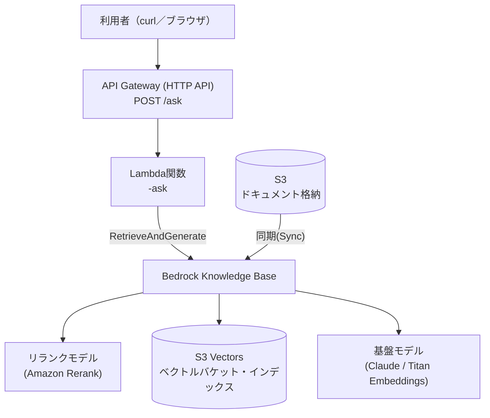

# 手順書: API Gateway・Lambda・Bedrock Knowledge Baseをマネジメントコンソールで構築する

[README.md](../README.md)の「手順（マネジメントコンソール操作）」はS3・S3 Vectors・Knowledge Baseの作成までを扱っており、Webフロントからの動作確認は`terraform/`が自動デプロイするLambda・API Gatewayを前提にしている。本書はその**Lambda・API Gateway部分も含めてすべて手動でマネジメントコンソールから構築する**ための手順書。Terraformを使わずに、この構成一式（S3 → S3 Vectors → Knowledge Base → Lambda → API Gateway）を再現したい場合に使う。

※ コンソールの画面・メニュー名はAWSのアップデートにより変わることがある。表示が異なる場合は名称の近いメニューを探すこと。

## 全体像



| コンポーネント | 役割 |
|---|---|
| S3（ドキュメント用） | 元データ（PDF・Markdown等）の格納先。Knowledge Baseのデータソース |
| S3 Vectors | Knowledge Baseのベクトルストア（埋め込みベクトルの保存先） |
| Bedrock Knowledge Base | RAGの検索・生成をまとめて担当。本リポジトリのKnowledge Baseはcustomer-managed型（S3 Vectors）のため、`RetrieveAndGenerate`を1回呼ぶだけで検索から回答生成まで完結する |
| リランクモデル（Amazon Rerank） | ベクトル類似度で広めに取った検索候補を、質問との関連度で並べ替えて絞り込む |
| Lambda（`<project>-ask`） | API Gatewayから受けたリクエストでKnowledge Baseの`RetrieveAndGenerate`APIを呼び出す薄い関数（[lambda_function.py](../lambda_function.py)） |
| API Gateway（HTTP API） | `POST /ask`エンドポイントを公開し、Lambdaへプロキシ統合する |

以降、`<project>`は任意のプレフィックス（例: `quest-basic`）に読み替える。

## 1. S3バケットを作成し、ドキュメントをアップロードする

1. マネジメントコンソールで**S3**を開く
2. 左メニュー「General purpose buckets」→**「バケットを作成」**
3. バケット名を入力（例: `<project>-documents`、全世界で一意な名前が必要）。リージョンは以降すべての手順で共通のリージョン（例: 東京 ap-northeast-1）を選択
4. 「このバケットのブロックパブリックアクセス設定」は**デフォルトのまま（すべてブロック）**にする
5. 「バケットを作成」をクリック
6. 作成したバケットを開き、**「アップロード」→「ファイルを追加」**で社内ドキュメントを選択し、**「アップロード」**を実行する。サンプルとして本リポジトリの`sample-docs/`を使ってもよい

## 2. S3 Vectorsのベクトルバケット・インデックスを作成する

1. S3コンソールの左メニュー「Vector buckets」を開く
2. **「ベクトルバケットを作成」**をクリックし、バケット名を入力（例: `<project>-vectors`）。暗号化はデフォルト（SSE-S3）のままでよい→作成
3. 作成したベクトルバケットを開き、**「インデックス」タブ→「ベクトルインデックスを作成」**
4. 以下を入力する
   - **インデックス名**: 任意（例: `kb-index`）
   - **次元数（dimension）**: 使用する埋め込みモデルに合わせる。Titan Text Embeddings V2なら`1024`
   - **距離指標（distance metric）**: コサイン類似度（cosine）でよい
   - **メタデータ設定（non-filterable metadata keys）**: `AMAZON_BEDROCK_TEXT`と`AMAZON_BEDROCK_METADATA`の**両方**を追加する（★重要。片方だけだと同期がほぼ全件失敗する）
5. 「ベクトルインデックスを作成」をクリック

## 3. Bedrockのモデルアクセスを有効化する

1. マネジメントコンソールで**Amazon Bedrock**を開く
2. 左メニュー下部の**「モデルアクセス」**をクリック
3. **「モデルアクセスを管理」**をクリック
4. 埋め込みモデル（**Titan Text Embeddings V2**）・回答生成モデル（**Claude**、選択可能なバージョンでよい）・リランクモデル（**Amazon Rerank 1.0**）にチェックを入れる
5. 「次へ」→利用規約を確認し**「送信」**。ステータスが「アクセス許可済み」になるまで数分待つ

## 4. Bedrock Knowledge Baseを作成する

1. Bedrockコンソール左メニューの**「Knowledge Bases」**（Builder toolsの中）を開き、**「作成」→「ナレッジベースを作成」**
2. ナレッジベース名を入力（例: `<project>-kb`）
3. **IAM権限**: 「新しいサービスロールを作成して使用する」を選択
4. データソースのタイプで**「S3」**を選択→次へ
5. データソース名を入力し、**S3 URI**で手順1で作成したバケットを指定
6. チャンク戦略はデフォルトのままでよい。**パース戦略**は「基盤モデルを使用した解析」（Foundation model parsing）を選び、画像内テキストの読み取りに使うモデル（Claude等）を指定する（スキャン画像PDFやスクショ付き文書を扱う場合に必須。標準パーサーだと画像内の文字が失われる）。**カスタム解析指示（parsing prompt）**の欄には以下を入力する（理由は[README.md](../README.md)の「補足: Excel（スクショ貼り付け）の画面仕様書を取り込む場合の注意」参照）

   ```
   このページは画面仕様書のスクリーンショットを含む日本語の業務文書です。
   ページに写っているテキストを要約・翻訳・言い換えをせず、原文どおり日本語のまま全て書き起こしてください。
   画面名・入力項目のラベル・選択肢・ボタン名・注記など、画面上に表示されている文言を漏れなく書き起こしてください。
   表がある場合は行と列の対応関係が分かる形で書き起こしてください。
   画面ID(例: SCR-003)など識別子となる番号・記号は省略せず保持してください。
   ```
7. **埋め込みモデル**: 「Titan Text Embeddings V2」を選択し、埋め込みの次元数を手順2のベクトルインデックスと**同じ値**に設定する
8. **ベクトルストア**: 「既存のベクトルストアを使用する」→ストアの種類で**「Amazon S3 Vectors」**を選択し、手順2で作成したベクトルバケット・ベクトルインデックスを指定する
9. 「次へ」で設定内容を確認し、**「ナレッジベースを作成」**をクリック
10. 作成後、Knowledge Baseの詳細画面に表示される**Knowledge Base ID**（例: `ABCD1234EF`）を控えておく（手順6のLambda環境変数で使う）

## 5. データソースを同期（Sync）する

1. 作成したKnowledge Baseの詳細画面を開く
2. 「データソース」欄で対象のデータソースにチェックを入れ、**「同期」**ボタンをクリック
3. ステータスが「同期中」→「使用可能」（Available/Ready）になるまで待つ
4. Knowledge Baseの**「テスト」**画面で質問し、ドキュメントの内容に基づいて回答が返ることを確認する

## 6. Lambda関数を作成する

Knowledge Baseの`RetrieveAndGenerate`APIを呼び出し、検索・リランキング・回答生成をまとめて行う薄いLambda関数（[lambda_function.py](../lambda_function.py)）を作成する。

### 6-1. 関数の作成

1. マネジメントコンソールで**Lambda**を開き、**「関数の作成」**
2. 「一から作成」を選択
3. 関数名: `<project>-ask`
4. ランタイム: **Python 3.12**（またはそれ以降）
5. アーキテクチャ: x86_64（デフォルトのままでよい）
6. 実行ロール: 「新しいロールを作成」（基本的なLambda権限を持つロールが自動生成される。追加権限は6-3で付与）
7. **「関数の作成」**をクリック

### 6-2. コードをデプロイする

1. 「コード」タブのコードエディタで、本リポジトリの[lambda_function.py](../lambda_function.py)の内容を`lambda_function.py`に貼り付ける（既存の雛形コードを全て置き換える）
2. **「Deploy」**ボタンをクリックしてコードを反映する

このコードは検索結果のリランキング（`rerankingConfiguration`）など比較的新しいBedrock KBのパラメータを使う。Lambdaランタイムに同梱のboto3が古いままだと`ParamValidationError: Unknown parameter`で失敗することがある（下記「つまづきポイント」参照）。

### 6-3. 環境変数を設定する

1. 「設定」タブ→「環境変数」→**「編集」**
2. 以下の3つを追加する
   - `KNOWLEDGE_BASE_ID`: 手順4-10で控えたKnowledge Base ID
   - `MODEL_ARN`: 回答生成に使うモデルのARN（クロスリージョンinference profileを使う場合はそのARN。例: `arn:aws:bedrock:ap-northeast-1:<account_id>:inference-profile/jp.anthropic.claude-sonnet-4-5-...`。`aws bedrock list-inference-profiles`で確認できる）
   - `RERANK_MODEL_ARN`: リランクモデルのfoundation-model ARN（例: `arn:aws:bedrock:ap-northeast-1::foundation-model/amazon.rerank-v1:0`。アカウント非依存の値で、`aws bedrock list-foundation-models`のmodelIdに`rerank`を含むものから確認できる）
3. **「保存」**

### 6-4. タイムアウトを延長する

Knowledge Baseの検索・生成（特にMermaidフローチャートを生成する質問）はデフォルトの3秒では終わらないことがある。

1. 「設定」タブ→「一般設定」→**「編集」**
2. **タイムアウト**を`30秒`に変更→保存

### 6-5. 実行ロールにBedrock権限を追加する

デフォルトの実行ロールにはCloudWatch Logsへの書き込み権限しかなく、Bedrockを呼び出す権限がない。

1. 「設定」タブ→「アクセス権限」→実行ロールのリンクをクリックしてIAMコンソールへ移動
2. **「許可を追加」→「ポリシーをアタッチ」**
3. 検索欄に`AmazonBedrockFullAccess`と入力し、該当するAWS管理ポリシーにチェックを入れる
4. **「許可を追加」**をクリック

呼び出すBedrock API（`RetrieveAndGenerate`・埋め込みモデル・生成モデル・リランクモデル）は用途によって必要なアクションが変わりやすく、アクション単位の最小権限ポリシーだと権限不足で都度詰まりやすい。ここでは検証のしやすさを優先し、AWS管理ポリシー`AmazonBedrockFullAccess`を1つアタッチする方式にしている（`terraform/api.tf`の`aws_iam_role_policy_attachment.base_lambda_bedrock`と同じ方式）。本番運用では利用するAPI・モデルARNを絞ったカスタムポリシーへの置き換えを検討すること。

## 7. API Gateway（HTTP API）を作成する

### 7-1. APIの作成

1. マネジメントコンソールで**API Gateway**を開き、**「APIを作成」**
2. 「HTTP API」の**「構築」**を選択
3. **「統合を追加」**→「Lambda」を選び、手順6で作成した関数（`<project>-ask`）を選択
4. API名: `<project>-api`
5. **「次へ」**

### 7-2. ルートの設定

1. メソッド: **POST**、リソースパス: **`/ask`**を指定する（統合は手順7-1で選んだLambda）
2. **「次へ」**

### 7-3. ステージの設定

1. ステージ名は**`$default`**のまま、**自動デプロイを有効**（デフォルト）にする
2. **「次へ」**→内容を確認して**「作成」**

### 7-4. CORSを設定する

ブラウザ（別ドメインのWebフロント）から呼び出す場合に必要。curlのみで検証する場合は省略可。

1. 作成したAPIの左メニュー**「CORS」**→**「設定」**
2. 以下を設定する
   - **Access-Control-Allow-Origin**: `*`
   - **Access-Control-Allow-Methods**: `POST`, `OPTIONS`
   - **Access-Control-Allow-Headers**: `content-type`
3. **「保存」**

### 7-5. 呼び出しURLを確認する

1. APIの詳細画面（左メニュー「Stages」→`$default`）に表示される**呼び出しURL（Invoke URL）**を控える（例: `https://abc123xyz.execute-api.ap-northeast-1.amazonaws.com`）

## 8. Webフロントを公開する（S3静的website hosting）

[frontend/index.html](../frontend/index.html)はプレーンHTML+JS（ビルド不要）のチャット画面。API呼び出し先が`__API_ENDPOINT__`というプレースホルダーのままファイルに埋め込まれているため、**手順7-5で控えた呼び出しURLに書き換えてからアップロードする**のがこの手順の最後のステップになる。

### 8-1. フロント公開用バケットを作成する

ドキュメント用バケット（手順1）とは別に、フロント配信専用のバケットを用意する（ドキュメント用バケットは非公開のまま維持するため）。

1. S3コンソールで**「バケットを作成」**
2. バケット名を入力（例: `<project>-frontend`）。リージョンは他の手順と同じものを選択
3. 「このバケットのブロックパブリックアクセス設定」の**「すべてのパブリックアクセスをブロック」のチェックを外す**（フロントは公開する必要があるため）。警告が出るが確認してチェックを外す
4. 「バケットを作成」

### 8-2. 静的website hostingを有効化する

1. 作成したバケットを開き、**「プロパティ」**タブ→一番下の**「静的ウェブサイトホスティング」→「編集」**
2. 「有効にする」を選択
3. インデックスドキュメント: `index.html`
4. **「変更の保存」**

### 8-3. バケットポリシーで公開読み取りを許可する

1. **「アクセス許可」**タブ→**「バケットポリシー」→「編集」**
2. 以下を貼り付ける（`<bucket_name>`は手順8-1で作成したバケット名に置き換える）

```json
{
  "Version": "2012-10-17",
  "Statement": [
    {
      "Sid": "PublicReadGetObject",
      "Effect": "Allow",
      "Principal": "*",
      "Action": "s3:GetObject",
      "Resource": "arn:aws:s3:::<bucket_name>/*"
    }
  ]
}
```

3. **「変更の保存」**

### 8-4. `index.html`のAPI URLを書き換えてアップロードする

1. ローカルの[frontend/index.html](../frontend/index.html)をテキストエディタで開く
2. ファイル末尾付近にある以下の行を探す

   ```js
   const API_ENDPOINT = "__API_ENDPOINT__";
   ```

3. `__API_ENDPOINT__`を手順7-5で控えた呼び出しURL（末尾のスラッシュなし、例: `https://abc123xyz.execute-api.ap-northeast-1.amazonaws.com`）に書き換える

   ```js
   const API_ENDPOINT = "https://abc123xyz.execute-api.ap-northeast-1.amazonaws.com";
   ```

4. 保存したファイルをS3コンソールの**「アップロード」→「ファイルを追加」**でバケット直下（キー: `index.html`）にアップロードする
5. 「プロパティ」タブの一番下、**「静的ウェブサイトホスティング」**欄に表示される**バケットウェブサイトエンドポイント**（例: `<bucket_name>.s3-website-ap-northeast-1.amazonaws.com`）をブラウザで開く（`http://`を付ける）

これで、参加者向けREADMEと同じ「ブラウザからチャットで質問する」体験がマネジメントコンソール操作のみで完成する。

## 9. 動作確認する

```bash
curl -X POST https://<invoke_url>/ask \
  -H "Content-Type: application/json" \
  -d '{"question": "同行者の氏名はどの画面で入力しますか？"}'
```

- `answer`（回答本文）・`sources`（出典の一覧。`uri`・`page`・`previewUrl`を持つ）・`sessionId`（Bedrock側が発行するセッションID。次のリクエストに含めると会話の文脈を踏まえた回答になる）が返ってくればOK
- ブラウザの場合は手順8-4最後で開いたURLからチャット画面で質問する
- エラーが出る場合は「つまづきポイント」（下記）を参照

## つまづきポイントとヒント

| つまづきポイント | ヒント |
|---|---|
| Lambdaが`AccessDeniedException`を返す | 手順6-5で`AmazonBedrockFullAccess`ポリシーが実行ロールに正しくアタッチされているか確認する |
| Lambdaが`ParamValidationError: Unknown parameter`を返す | ランタイム同梱のboto3/botocoreが古く、`rerankingConfiguration`等の新しいパラメータを認識できていない。Lambdaの「レイヤー」に`boto3`・`botocore`の新しいバージョンを含むレイヤーを追加する（`requirements.txt`に固定バージョンあり） |
| Lambdaがタイムアウトする | 手順6-4でタイムアウトを30秒に延長したか確認する |
| API Gatewayから呼び出すと403/500になる | Lambda関数側にAPI Gatewayからの呼び出しを許可するリソースベースポリシーが必要（コンソールでLambda統合を作成した場合は自動付与されるが、権限エラーが出る場合はLambdaの「設定」→「アクセス権限」→「リソースベースのポリシーステートメント」でAPI Gatewayからの`lambda:InvokeFunction`が許可されているか確認する） |
| ブラウザから呼び出すとCORSエラーになる | 手順7-4のCORS設定（特に`Access-Control-Allow-Headers`に`content-type`が含まれているか）を確認する |
| 画面は表示されるが質問すると必ずエラーになる | 手順8-4で`__API_ENDPOINT__`を実際の呼び出しURLに書き換え忘れていないか確認する（プレースホルダーのままだとfetch先が存在せず失敗する） |
| フロントのURLを開いても真っ白・403になる | 手順8-1でパブリックアクセスブロックを解除したか、手順8-3のバケットポリシーを保存したか確認する |
| ブラウザで開くと更新した内容が反映されない | ブラウザキャッシュが原因のことが多い。スーパーリロード（Ctrl+Shift+R等）を試す |
| 同期がほぼ全件失敗する | 手順2の`non-filterable metadata keys`に`AMAZON_BEDROCK_TEXT`と`AMAZON_BEDROCK_METADATA`の両方を含めているか確認する |
| Excelにスクショを貼り付けた仕様書を取り込みたい | そのままアップロードしてもセル内画像は認識されない。PDFにエクスポートしてから取り込む（詳細は[README.md](../README.md)の「Excel（スクショ貼り付け）の画面仕様書を取り込む場合の注意」参照） |

## 後片付け

サンドボックスアカウントの費用を積み上げないよう、検証が終わったら作成したリソースを削除すること。削除順序の目安（依存関係の逆順）:

1. フロント公開用S3バケット（オブジェクトを空にしてから削除）
2. API Gateway（API本体を削除）
3. Lambda関数
4. LambdaのIAMロール（ロールを削除すればアタッチした管理ポリシーの関連付けも解除される）
5. Bedrock Knowledge Base（データソースごと削除される）
6. Knowledge BaseのIAMロール
7. S3 Vectorsのインデックス→ベクトルバケット
8. S3バケット（ドキュメント。オブジェクトを空にしてから削除）

## 参考

- Terraformでこの構成一式を自動構築する場合は[terraform/](../terraform/)を参照（`terraform apply`一発で本書の手順すべてが再現される）
- Lambdaのコード解説は[README.md](../README.md)の「`lambda_function.py`の解説」を参照
